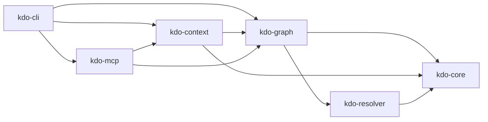

# kdo

**Workspace manager for the agent era. Cuts AI agent token consumption on polyglot monorepos.**

kdo scans your workspace, builds a dependency graph, and serves structured context via MCP instead of letting agents traverse the filesystem blindly. Turbo/Nx/Moon/Bun don't speak Rust + Python + Anchor in one graph — kdo does, and ships an MCP server with seven tools, agent profiles (Claude Code, OpenClaw, generic), and a loop guard that prevents deadly token-burn retries.

## Install

kdo is pre-`0.1.0` — all current releases are alphas. You have to opt in explicitly.

**Prebuilt binary (fastest — no Rust toolchain needed):**

```bash
curl -fsSL https://raw.githubusercontent.com/vivekpal1/kdo/main/install.sh | bash -s -- --from-release
```

**From crates.io (requires the version flag for pre-releases):**

```bash
cargo install kdo --version "0.2.0-alpha.1"
```

> `cargo install kdo` without `--version` fails with "could not find `kdo` in registry"
> because Cargo skips pre-releases by default. Once `0.1.0` stable ships, the plain
> `cargo install kdo` command will just work.

**From source (requires Rust toolchain):**

```bash
cargo install --git https://github.com/vivekpal1/kdo
# or
curl -fsSL https://raw.githubusercontent.com/vivekpal1/kdo/main/install.sh | bash
```

**Docker:**

```bash
docker pull ghcr.io/vivekpal1/kdo:latest
docker run -v $(pwd):/workspace ghcr.io/vivekpal1/kdo list
```

**Upgrade later:**

```bash
kdo upgrade               # pull the latest release binary
kdo upgrade --dry-run     # show what would change
```

## Quick start

```bash
# Initialize a new workspace (or adopt an existing repo)
kdo init

# Create a new project interactively
kdo new my-service
# ? Language: [rust] / typescript / python / anchor
# ? Project type: [library] / binary
# ? Framework: [none] / react / next

# List all projects
kdo list

# Show dependency graph
kdo graph --format dot | dot -Tsvg > graph.svg

# Get agent-optimized context for a project (within token budget)
kdo context vault-program --budget 2048

# Run a task across all projects (build, test, lint, dev, etc.)
kdo run build
kdo run test --filter vault-program

# Run an arbitrary command in each project
kdo exec "ls src"

# Find projects affected by recent changes
kdo affected --base main

# Check workspace health
kdo doctor

# Generate shell completions
kdo completions zsh >> ~/.zshrc

# Start MCP server for AI agents
kdo serve --transport stdio
```

## How it works

### `kdo init`

On an **empty directory**: scaffolds a workspace template with `kdo.toml`, `.kdo/`, `.kdoignore`, and `.gitignore` — ready for `kdo new`.

On an **existing repo**: discovers all projects, builds the dependency graph, and generates context files.

Creates two things:

1. **`kdo.toml`** at workspace root (committed) — workspace declaration + task definitions:

```toml
[workspace]
name = "my-monorepo"

[tasks]
build = "cargo build"
test = "cargo test"
lint = "cargo clippy"
```

2. **`.kdo/`** directory (gitignored) — cache for agents:

```
.kdo/
├── config.toml       # workspace configuration
├── cache/            # content hash cache for incremental updates
├── context/          # per-project context files (agents read here)
│   ├── vault-program.md
│   ├── vault-sdk.md
│   └── ...
└── graph.json        # cached dependency graph snapshot
```

### `kdo new <name>`

Interactive project scaffolding. Prompts for language, project type, and framework, then generates a complete project skeleton with manifest, source files, and tests. Supports:

- **Rust**: library or binary, clean Cargo.toml
- **TypeScript**: plain, React, or Next.js, with tsconfig
- **Python**: plain, FastAPI, or CLI (click), with pyproject.toml
- **Anchor**: Solana program skeleton with Anchor.toml

### `.kdoignore`

Works like `.gitignore` — controls which files kdo excludes from context generation and content hashing. Created automatically by `kdo init` with sensible defaults:

```
node_modules/
target/
dist/
build/
__pycache__/
.git/
.kdo/
*.lock
```

## Benchmark

Reproducible via `kdo bench` — measures the bytes an fs-walking agent would read
against the bytes kdo actually returns for the same scope. No mocking, no fake
numbers.

**`fixtures/sample-monorepo`** (Anchor program + TS SDK + Rust lib + Python tool):

| Task | baseline | with kdo | reduction |
|------|----------|----------|-----------|
| fix-withdraw-bug | 463 tok | 479 tok | 0.0% |
| add-vault-method | 579 tok | 519 tok | 10.3% |
| refactor-fee-harvest | 990 tok | 640 tok | **35.3%** |
| **average** | 2.0k tok | 1.6k tok | **19.4%** |

These numbers are from a deliberately small fixture — real monorepos have much
larger source files, which makes the baseline grow while kdo stays capped at
the context-budget cost. Run `kdo bench` on your own repo with a real
`.kdo/bench/tasks.toml` for honest numbers against your actual codebase.

For a real-session measurement (not proxy), use:

```bash
kdo bench --from-log ~/.claude/projects/<slug>/<session>.jsonl
```

## Architecture



| Crate | Purpose |
|-------|---------|
| `kdo-core` | Types (`Project`, `Dependency`, `Language`), errors (`KdoError`), token estimator |
| `kdo-resolver` | Manifest parsers: `Cargo.toml`, `package.json`, `pyproject.toml`, `Anchor.toml` |
| `kdo-graph` | `WorkspaceGraph` via petgraph — discovery, DFS/BFS queries, blake3 hashing, cycle detection |
| `kdo-context` | Tree-sitter signature extraction, context generation, token budget enforcement |
| `kdo-mcp` | MCP server (built on rmcp 0.16) — 7 tools, resources, loop-guard, agent profiles |
| `kdo-cli` | Clap subcommands, interactive scaffolding, tabled output |

## Agent setup

One command per agent:

```bash
kdo setup claude --global         # Claude Code, user-level MCP registration + CLAUDE.md
kdo setup openclaw --global       # OpenClaw, AgentSkills-spec SKILL.md + openclaw.json merge
kdo setup claude --dry-run        # preview every file + command, touch nothing
```

Drop `--global` to write into the current workspace only. Re-running is safe —
sentinels preserve surrounding user content; JSON merges preserve siblings.

### Manual registration (any MCP client)

```bash
kdo serve --transport stdio --agent generic
```

`--agent` tunes context budgets, loop-detection windows, and tool-description
verbosity. Profiles: `claude`, `openclaw`, `generic` (default).

**Loop guard.** The server returns a structured `"loop detected"` error after
N identical tool calls in a row (OpenClaw: 3, others: 5). Prevents deadly
token-burn loops — the agent sees the error and changes strategy instead of
silently retrying.

## MCP tools

| Tool | Description |
|------|-------------|
| `kdo_list_projects` | List all projects with name, language, summary, dep count |
| `kdo_get_context` | Token-budgeted context bundle (summary + API signatures + deps) |
| `kdo_read_symbol` | Read a specific function/struct/trait body via tree-sitter |
| `kdo_dep_graph` | Dependency closure or dependents for a project |
| `kdo_affected` | Projects changed since a git ref |
| `kdo_search_code` | Search for a pattern across all workspace source files |

## Supported languages

- **Rust** — `Cargo.toml`, tree-sitter signature extraction
- **TypeScript / JavaScript** — `package.json`, `tsconfig.json` detection
- **Python** — `pyproject.toml` (PEP 621 + Poetry)
- **Solana Anchor** — `Anchor.toml`, CPI dependency tracking

## CLI reference

```
kdo init                              # Initialize workspace
kdo new <name>                        # Create project interactively
kdo run <task> [--filter project]     # Run task across projects
kdo exec <cmd> [--filter project]     # Run command in each project
kdo list [--format table|json]        # List projects
kdo graph [--format text|json|dot]    # Show dependency graph
kdo context <project> [--budget N]    # Generate context bundle
kdo affected [--base ref]             # Changed projects since ref
kdo doctor                            # Validate workspace health
kdo completions <shell>               # Generate shell completions
kdo serve [--transport stdio]         # Start MCP server
```

All commands support `--format json` for scripting.

## Composability

kdo operates at the **workspace layer** — discovering projects, building the dependency graph, and serving structured context. For symbol-level intelligence within a project, see [scope-cli](https://github.com/nicholasgasior/scope-cli) — they compose cleanly.

## Roadmap

See [TODO.md](TODO.md) for the full roadmap. Key upcoming items:

- Content-addressable task output caching
- Watch mode with filesystem events
- SSE transport for MCP
- Go, Java/Kotlin language support
- Remote cache (S3/GCS)
- `kdo run` parallel execution with dependency ordering

## License

MIT
