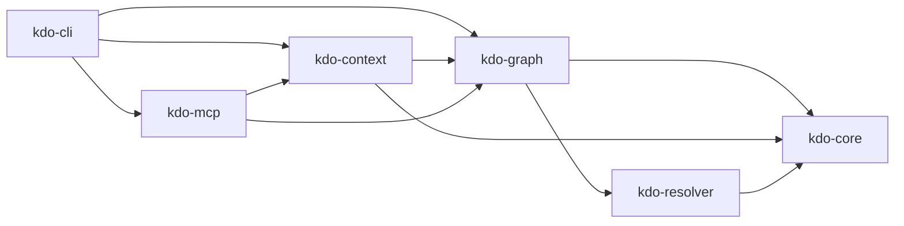

# kdo

**Workspace manager for the agent era. Cuts Claude Code token consumption 5-10x on polyglot monorepos.**

kdo scans your workspace, builds a dependency graph, and serves structured context via MCP instead of letting agents traverse the filesystem blindly. Current tools (Turbo, Nx, Moon, Bun) burn 60-80% of agent tokens on navigation. kdo fixes this.

## Install

```bash
cargo install --git https://github.com/vivekpal1/kdo
```

## Quick start

```bash
cd your-monorepo

# Scan workspace and generate CONTEXT.md files
kdo init

# List projects
kdo list

# Show dependency graph
kdo graph --format dot | dot -Tsvg > graph.svg

# Get agent-optimized context for a project (within token budget)
kdo context vault-program --budget 2048

# Find projects affected by recent changes
kdo affected --base main
```

## Benchmark

Measured on a Solana monorepo (3 Rust programs + TS SDK + Python tool):

| Method | ~Tokens | Description |
|--------|---------|-------------|
| `find + cat *.rs *.ts *.py` | ~12,400 | Raw filesystem traversal |
| `kdo context vault-program` | ~1,800 | Structured, budgeted context |
| **Reduction** | **~7x** | Only public API signatures, summaries, deps |

## Architecture



**Crates:**

| Crate | Purpose |
|-------|---------|
| `kdo-core` | Types (`Project`, `Dependency`, `Language`), errors (`KdoError`), token estimator |
| `kdo-resolver` | Manifest parsers: `Cargo.toml`, `package.json`, `pyproject.toml`, `Anchor.toml` |
| `kdo-graph` | `WorkspaceGraph` via petgraph. Discovery, DFS/BFS queries, blake3 hashing, cycle detection |
| `kdo-context` | Tree-sitter signature extraction, `CONTEXT.md` generation, token budget enforcement |
| `kdo-mcp` | MCP server (JSON-RPC 2.0 over stdio) exposing 5 tools |
| `kdo-cli` | Clap subcommands, tabled output, JSON mode |

## MCP setup

### Claude Code

Add to `~/.claude/mcp_servers.json` or `.claude/mcp_servers.json`:

```json
{
  "mcpServers": {
    "kdo": {
      "command": "kdo",
      "args": ["serve", "--transport", "stdio"]
    }
  }
}
```

### Cursor

Add to `.cursor/mcp.json`:

```json
{
  "mcpServers": {
    "kdo": {
      "command": "kdo",
      "args": ["serve", "--transport", "stdio"]
    }
  }
}
```

## MCP tools

| Tool | Description |
|------|-------------|
| `kdo_list_projects` | List all projects with name, language, summary, dep count |
| `kdo_get_context` | Token-budgeted context bundle (summary + API signatures + deps) |
| `kdo_read_symbol` | Read a specific function/struct/trait body via tree-sitter |
| `kdo_dep_graph` | Dependency closure or dependents for a project |
| `kdo_affected` | Projects changed since a git ref |

## Supported languages

- Rust (`Cargo.toml`)
- TypeScript / JavaScript (`package.json`)
- Python (`pyproject.toml`)
- Solana Anchor (`Anchor.toml`)

## Composability

kdo operates at the **workspace layer** — discovering projects, building the dependency graph, and serving structured context. For symbol-level intelligence within a project, see [scope-cli](https://github.com/nicholasgasior/scope-cli) — they compose cleanly.

## Roadmap

Implemented:

- Workspace discovery and dependency graph
- Tree-sitter signature extraction (Rust, TypeScript, Python)
- Token-budgeted CONTEXT.md generation
- MCP server (stdio transport)
- CLI with table and JSON output
- `affected` command (git-based change detection)

Not yet implemented:

- Task runner execution with caching
- Content-addressable cache for task outputs
- Install management (delegate to pnpm/cargo/uv)
- Remote cache
- SSE transport for MCP
- Windows path edge cases
- Yarn PnP support
- `similar`, `source` commands

## License

MIT
