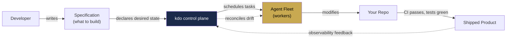
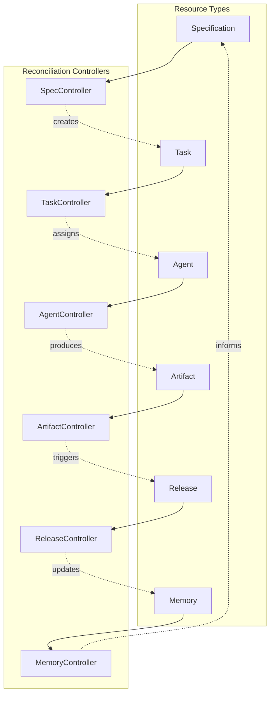
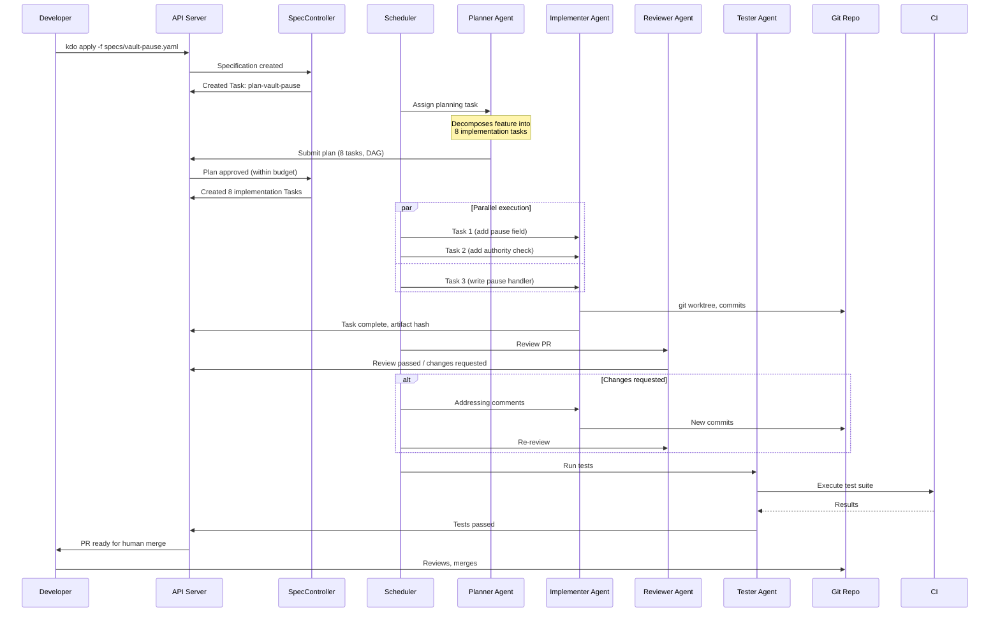

# kdo Factory — the coding factory architecture

> **Thesis:** Kubernetes is to containers what kdo-factory is to AI agents.
> A declarative control plane, a desired-state reconciliation loop, a scheduler
> that places work on the best available worker, durable execution that survives
> crashes, and a fleet of agents that run 24/7 turning specifications into shipped
> products.

## The problem with current agent tooling

Every existing agent tool is stuck at **conductor mode** — one agent, one task, one
developer sitting at a terminal, prompting constantly. You are the bottleneck.
The moment you stop typing, the agents stop working. Token bills compound. Loops
burn budget. Context disappears between sessions.

The research tells you exactly where the ceiling is:

- **95% of AI initiatives fail to reach production** (MIT, 2026) — not because models
  lack capability, but because systems lack architectural robustness.
- **Multi-agent workflows grew 327% between June and October 2025** (Databricks) —
  the market is moving to orchestration, and most teams are using duct tape.
- **40% of agentic AI projects face cancellation** (Gartner) — the failure pattern
  is always the same: no durable execution, no observability, no state management.
- Steve Yegge's 8-level ladder: **most devs are stuck at Level 3-4**. Orchestration
  starts at Level 6 and needs a fundamentally different toolset.

kdo today ships Levels 3-5. The factory lifts it to Levels 6-8.

## The factory model



The developer writes a specification. The control plane reconciles reality
toward that specification. Agents are cattle, not pets. Failures are recorded,
replayed, and survived. The developer approves merges, reviews architecture,
and sleeps at night.

## The three planes

Borrowed directly from Kubernetes architecture, adapted for AI agents:

### 1. Control Plane (the brain)

Stateless coordinator. Every decision flows through here. Components:

- **API Server** — the single front door. All CLI calls, all agent callbacks, all
  observability queries. Stateless, horizontally scalable, the chokepoint that
  simplifies everything else.
- **State Store** — embedded SQLite (dev) or Postgres (team). Every workflow event,
  every agent decision, every artifact hash lives here. Single source of truth.
- **Scheduler** — matches pending tasks to available agents. Scores agents on
  capability, cost, context window fit, past performance on similar tasks.
- **Controller Manager** — runs the reconciliation loops. ~10 controllers watching
  for drift between spec and reality: SpecController, AgentController,
  ArtifactController, ReleaseController, MemoryController, and so on.

### 2. Data Plane (the muscle)

The fleet of agents doing the actual work. Components:

- **Agent Node** — one process per running agent. Wraps an LLM client
  (Anthropic/OpenAI/OpenClaw/local). Manages its own context window, memory,
  tool execution.
- **Agent-proxy** — the kubelet equivalent. Sits on every node, reports health
  back to the control plane, receives task assignments, streams logs.
- **Workspace Runtime** — the existing kdo MCP server. Every agent gets one.
  Serves context, enforces budgets, detects loops.
- **Sandbox Runtime** — git worktree + optional Docker container per agent.
  Isolation. Blast radius containment. Rollback on failure.

### 3. Memory Plane (the nervous system)

The shared substrate that makes agents actually learn. Components:

- **Workspace Memory** — the existing `.kdo/memory/` directory. Git-committable,
  human-readable markdown.
- **Episodic Memory** — every task execution recorded as an event log. Replayable.
  Auditable. "How did we fix this last time?"
- **Semantic Memory** — embeddings of decisions, solutions, architectural
  patterns. Retrievable across projects and agents.
- **Procedural Memory** — compiled skills. Patterns that work, promoted from
  episodes to reusable playbooks.

## The core primitives

Everything in kdo-factory is a resource, every resource has a controller, every
controller has a reconciliation loop. This is the Kubernetes pattern.



Every edge in that graph is a reconciliation loop. Nothing is imperative.
Everything is declarative. You write a Specification. The system makes it real.

## The factory in motion (one concrete example)

Developer commits this to `specs/feature-vault-pause.yaml`:

```yaml
kind: Feature
metadata:
  name: vault-emergency-pause
  project: vault-program
spec:
  description: |
    Add emergency pause capability to the vault program. Any of the three
    pause authorities can trigger. Unpause requires admin multisig.
  acceptance:
    - pause() instruction callable by pause_authorities
    - unpause() instruction callable only by admin
    - paused state blocks deposits, redeems, harvest
    - claim_redeem() still works when paused
    - unit tests cover all three authority paths
    - integration test covers full pause/unpause cycle
  budget:
    max_tokens: 200000
    max_iterations: 8
    max_cost_usd: 15.00
  agents:
    planner: claude-opus-4-6
    implementer: claude-sonnet-4-6
    reviewer: gpt-5
    tester: claude-haiku-4-5
```

The control plane picks this up. Here's what happens next, autonomously:



Developer role: write spec, review PR. 10 minutes of attention. Rest runs while
you sleep. Every agent action is logged. Every decision is replayable. Every
failure is recoverable. Budget gates prevent runaway costs.

## Why this is different from everything else

| Tool | Architecture | What's missing |
|------|-------------|---------------|
| Claude Code | Conductor (1 agent, 1 human) | Autonomous execution, fleet, durable state |
| Conductor (Mac app) | Parallel worktrees | Control plane, reconciliation, spec-driven |
| Agent-orchestrator (Composio) | Plugin-based dispatcher | Durable execution, memory plane, agent-agnostic runtime |
| Claude-Flow | 11K-star orchestration | No k8s-grade reconciliation, no agent-agnostic layer |
| Temporal | Durable execution (generic) | No AI-specific primitives, no memory plane, no agent fleet |
| LangGraph / CrewAI | Graph orchestration frameworks | Libraries, not infrastructure. No daemon, no scheduler. |
| OpenClaw | Personal assistant via messaging | No code-factory semantics, no repo-aware reconciliation |

kdo-factory is the missing piece: **k8s-grade infrastructure + Temporal-grade
durability + agent-native primitives + your existing kdo runtime**.

## What we keep from kdo today

- The MCP server (now just one component of Agent Node)
- CONTEXT.md generation, signature extraction, token budgets
- Loop detection and circuit breakers
- Polyglot manifest parsing
- The workspace compiler
- Claude Code and OpenClaw compatibility (first-class clients of the API Server)

## What we add

Four new binaries, one new daemon model:

- `kdo-apiserver` — the control plane front door
- `kdo-scheduler` — the task matchmaker
- `kdo-controllers` — the reconciliation loop runner
- `kdo-agent` — the per-agent runtime (replaces direct Claude Code / OpenClaw
  invocation when running in factory mode)

All four are Rust. All four communicate via the API server. All four can
be replaced by alternative implementations (agent-agnostic by design).

## Continue reading

1. `01-CONTROL-PLANE.md` — API server, state store, scheduler, controllers
2. `02-DATA-PLANE.md` — Agent nodes, sandbox runtime, workspace runtime
3. `03-MEMORY-PLANE.md` — Workspace, episodic, semantic, procedural memory
4. `04-RECONCILIATION-LOOPS.md` — The 10 core controllers, what they watch, what they do
5. `05-SPEC-LANGUAGE.md` — The YAML spec format, how devs declare desired state
6. `06-BRING-YOUR-OWN-LLM.md` — API key management, model routing, cost control
7. `07-EXECUTION-PIPELINE.md` — From spec commit to shipped release
8. `08-ROADMAP.md` — What ships in v0.3, v0.4, v1.0
