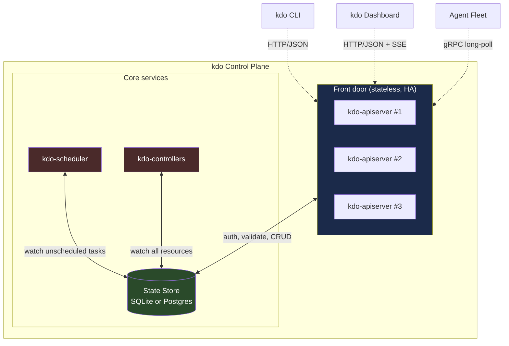
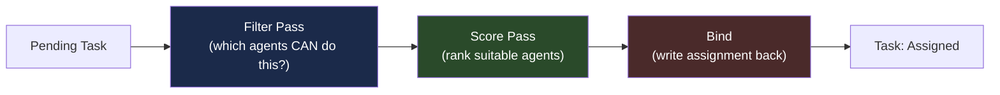

# 01 — Control Plane

> **Pattern stolen:** Kubernetes control plane.
> **Adapted for:** AI agent fleets instead of container pods.

The control plane is the brain. Nothing else talks to the state store directly.
Nothing else makes scheduling decisions. If the control plane is down, agents
can keep working on their current task but no new tasks get scheduled. If the
state store is down, the cluster is down — same rule as Kubernetes.

## Architecture



**Hard rule from Kubernetes that we preserve:** no component talks to another
component directly. Everything flows through the API server. The scheduler
doesn't talk to agents. Controllers don't talk to the scheduler. Agents don't
talk to the state store. This single rule eliminates 80% of distributed-system
bugs.

## Components

### API Server (`kdo-apiserver`)

**One job:** process API requests. Not schedule. Not run controllers. Not manage
agents. Just:

1. Authenticate the caller (API key, bearer token, or local Unix socket)
2. Authorize the action (RBAC or simple user/admin for single-tenant)
3. Validate the resource (JSON schema on every object)
4. Persist to the state store
5. Stream watch events to subscribers

Stateless by design. You can run three of them behind a load balancer if you
want HA, one of them if you're a solo dev. The only shared state is in the
store.

**Exposed surface (HTTP/JSON + gRPC streaming for agents):**

```
POST   /api/v1/specifications          Create a spec
GET    /api/v1/specifications          List specs
GET    /api/v1/specifications/{name}   Get spec
PATCH  /api/v1/specifications/{name}   Update spec
DELETE /api/v1/specifications/{name}   Delete spec

POST   /api/v1/tasks                   Create task (usually controllers do this)
GET    /api/v1/tasks?status=pending    Watch pending tasks (scheduler uses this)
PATCH  /api/v1/tasks/{id}              Update task (agents report back here)

POST   /api/v1/agents/register         Agent node registration
POST   /api/v1/agents/{id}/heartbeat   Agent health check
GET    /api/v1/agents/{id}/work        Long-poll for assigned task

GET    /api/v1/events?since=<cursor>   SSE stream of all events (dashboard, audit)
```

**Implementation:** Axum or Poem in Rust. JSON schema validation via
`jsonschema`. Long-poll for agent work using `tokio::sync::Notify`. Event stream
via SSE with cursor-based resume.

### State Store

**One job:** store every object and emit watch events.

**Single-tenant / dev mode:** embedded SQLite in `.kdo/factory.db` via `sqlx`.
Write-ahead logging on. Single file, git-ignored, trivial backup.

**Team mode:** Postgres. Still single-writer from the API server's perspective,
just more durable and supports HA. Same schema.

**Schema (simplified):**

```sql
CREATE TABLE resources (
    kind        TEXT NOT NULL,           -- Specification, Task, Agent, etc.
    name        TEXT NOT NULL,
    namespace   TEXT NOT NULL DEFAULT 'default',
    uid         TEXT NOT NULL UNIQUE,    -- UUID v7 for monotonic ordering
    revision    BIGINT NOT NULL,         -- bumped on every update
    spec        JSONB NOT NULL,          -- the desired state
    status      JSONB,                   -- the actual state (reported by controllers)
    created_at  TIMESTAMP NOT NULL,
    updated_at  TIMESTAMP NOT NULL,
    PRIMARY KEY (kind, namespace, name)
);

CREATE INDEX resources_by_uid    ON resources(uid);
CREATE INDEX resources_revision  ON resources(revision);

CREATE TABLE events (
    id          BIGSERIAL PRIMARY KEY,
    kind        TEXT NOT NULL,    -- what changed
    uid         TEXT NOT NULL,    -- of which resource
    event_type  TEXT NOT NULL,    -- Created, Updated, Deleted
    revision    BIGINT NOT NULL,
    timestamp   TIMESTAMP NOT NULL,
    data        JSONB
);
```

Every update to `resources` inserts into `events`. The API server streams events
to watchers via SSE. Watchers (scheduler, controllers, dashboard) track a
cursor (the max event ID seen) for resume-on-reconnect.

**This is the etcd equivalent.** You don't need etcd — it's overkill for
single-tenant. SQLite with WAL gives you the same semantics (atomic commits,
readers don't block writers, writers don't block readers) for 1-2 orders of
magnitude less operational burden.

### Scheduler (`kdo-scheduler`)

**One job:** match pending tasks to available agents.

Watches the API server for tasks with `status: Pending` and no
`assigned_agent`. For each pending task, runs the scheduling pipeline:



**Filter pass** — rules that must be satisfied:
- Agent capability includes the task's required skills (e.g. `language:rust`,
  `tool:anchor-build`)
- Agent has capacity (not at its max parallel task limit)
- Agent's model supports the required context size
- Agent's budget allows (cost estimate fits remaining budget)
- Agent is not in `Cooldown` state (recovering from a failure)

**Score pass** — the filtered set is ranked by a weighted score:
- Past success rate on similar tasks (episodic memory lookup)
- Cost — cheaper agent wins ties
- Latency — closer model wins
- Context-window fit — no waste
- Freshness — recently-used agents get a small bonus (warm caches)

The highest-scored agent is bound to the task by writing
`task.status.assigned_agent = <agent_id>` via the API server. The agent's
long-poll on `/agents/{id}/work` returns immediately with the task.

**This is the kube-scheduler equivalent** — with one important difference: it
also scores on cost. AI agents are not free like CPU cores.

### Controller Manager (`kdo-controllers`)

**One job:** run the reconciliation loops.

Every controller implements the same interface:

```rust
#[async_trait]
pub trait Controller: Send + Sync {
    /// What resource kind does this controller watch?
    fn watches(&self) -> &'static str;

    /// Called once per observed change event.
    /// Must be idempotent — same input = same result.
    async fn reconcile(&self, ctx: &ControllerContext, event: ResourceEvent)
        -> Result<ReconcileResult, ControllerError>;
}

pub enum ReconcileResult {
    /// Done. Don't run again unless something changes.
    Completed,
    /// Requeue in N seconds (backoff).
    RequeueAfter(Duration),
    /// Failed but might work next time. Exponential backoff applies.
    Retry(String),
}
```

Controllers run concurrently, coordinated only through the state store. If a
controller crashes, the next tick picks up where it left off. If two
controllers try to update the same resource, optimistic concurrency via the
`revision` field resolves the conflict (one wins, the other retries).

The 10 core controllers are detailed in `04-RECONCILIATION-LOOPS.md`.

## Failure modes and recovery

| Failure | Recovery |
|---------|----------|
| API server crash | Stateless — new instance picks up, clients retry |
| State store crash | Cluster down until recovered. Backup via SQLite file or Postgres WAL. |
| Scheduler crash | Scheduled tasks continue. Pending tasks wait until restart. No data loss. |
| Controller crash | Reconciliation pauses. Restart resumes from last observed event. |
| Agent crash | Task marked failed on missed heartbeat. Scheduler reassigns to another agent. |
| Network partition | Agents keep working on current task. On reconnect, they push their event log. |

The architecture is **crash-only**. Every component can die at any time. Every
action is persisted before being acknowledged. Every resume is idempotent.

## Scaling numbers

Single-node Rust on a mid-range laptop should comfortably handle:

- **10,000+ resources** in the state store
- **500+ events/second** through the API server
- **50+ concurrent agents** (limited by your LLM API rate limits, not by kdo)
- **Sub-10ms** state-store reads, **sub-50ms** API server round-trips

If you need more than that, you are not a solo dev with one Anchor monorepo
any more. You're an enterprise running a platform. That's when you move the
state store to Postgres and horizontally scale the API server.

## Implementation order

1. Embedded SQLite state store with WAL, events table, watch API
2. API server with Specification + Task CRUD
3. Scheduler with filter-only (no scoring yet)
4. SpecController (first controller, proves the pattern)
5. AgentController + agent heartbeat
6. TaskController (scheduler binds, this watches assignments)
7. The rest of the controllers (ArtifactController, ReleaseController, etc.)
8. Postgres state store as an optional backend
