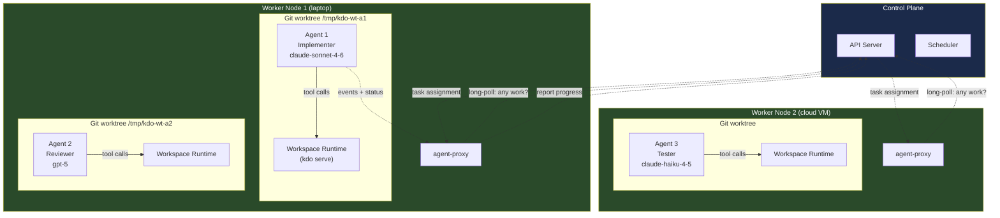
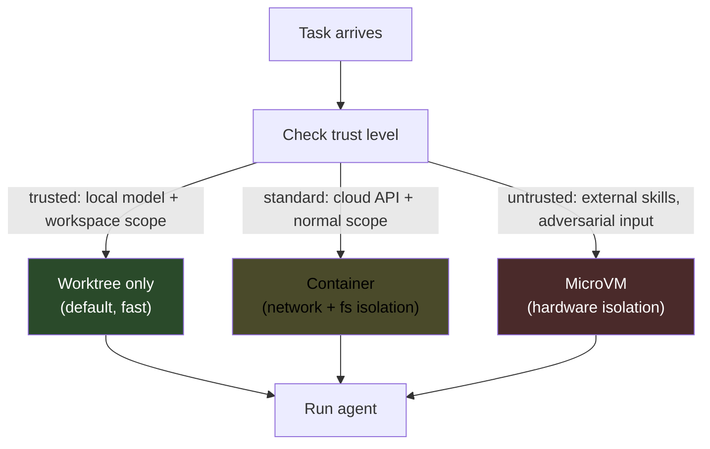
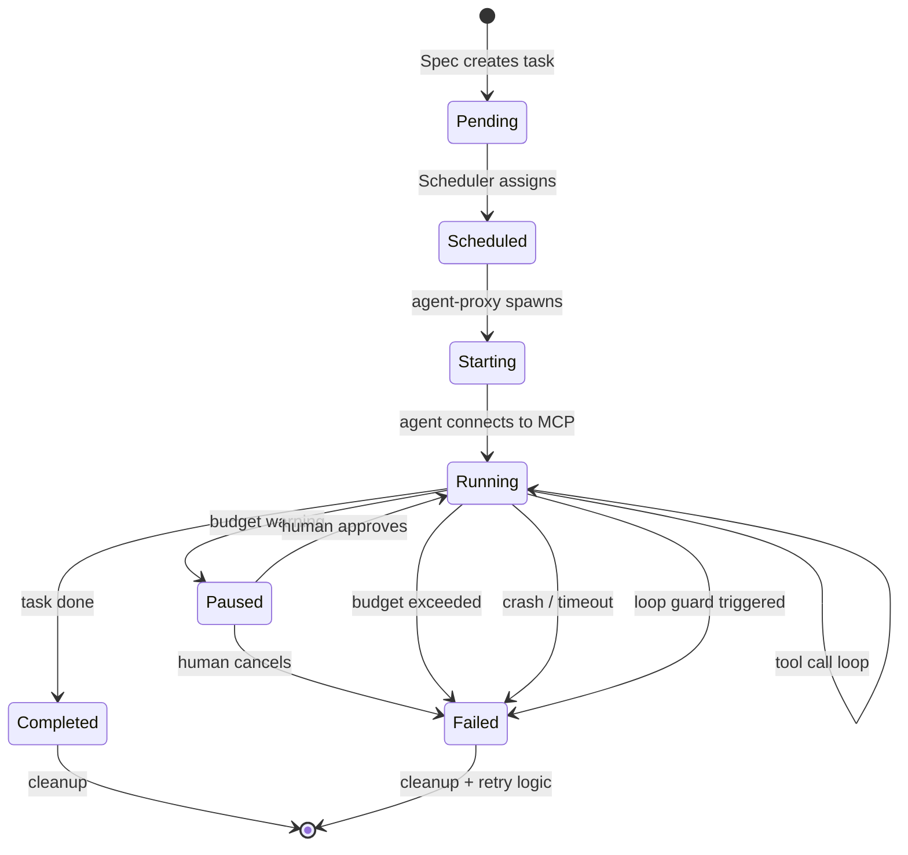
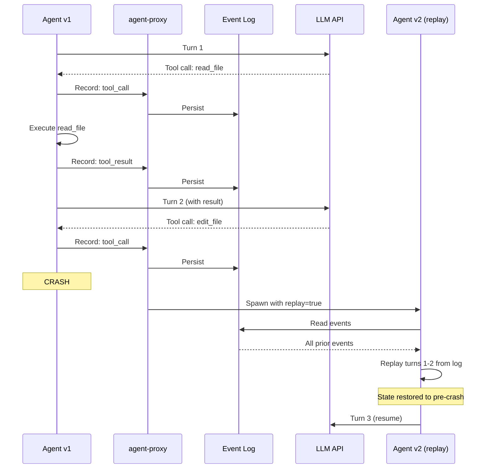

# 02 — Data Plane

> **Pattern stolen:** Kubernetes data plane (kubelet + container runtime).
> **Adapted for:** AI agents instead of container pods.

The data plane is where work actually happens. Every running agent is a process
on a worker node. Every worker node runs an `kdo-agent-proxy` that reports to
the control plane (the kubelet equivalent). Agents are isolated in git
worktrees (the pod equivalent) and optionally Docker containers (for hard
isolation).

## Architecture



## Components

### Agent Proxy (`kdo-agent-proxy`)

**One job:** be the kubelet.

One per worker node. The agent-proxy doesn't run LLM calls itself — it manages
the agents that do. Responsibilities:

1. **Register with the control plane** at startup. Announces capabilities
   (installed LLM adapters, max parallel agents, CPU/memory/disk available,
   OS, architecture).
2. **Heartbeat** every 10 seconds. If a heartbeat is missed for 30 seconds,
   the control plane considers this node unhealthy and reassigns its tasks.
3. **Long-poll for work.** Holds an HTTP connection open to
   `/agents/{id}/work`. Control plane returns a task when one is assigned.
4. **Spawn agent processes.** For each assigned task, creates a git worktree,
   starts the agent binary with the right LLM adapter, passes the task spec.
5. **Collect events from agents** (tool calls, thinking, artifacts) and forward
   them to the control plane event stream.
6. **Enforce budgets.** Kills agents that exceed their token budget, time
   budget, or cost budget.
7. **Cleanup.** When an agent finishes or fails, clean up the worktree, kill
   lingering processes, release the lock.

**This runs as a long-lived daemon.** `systemctl start kdo-agent-proxy` on Linux,
`launchd` on macOS, Windows Service on Windows.

### Agent Node (`kdo-agent`)

**One job:** execute one task with one LLM, then die.

The `kdo-agent` binary is not long-lived. It's spawned per task, runs until
the task completes or fails, then exits. This is the **pod** equivalent — cattle,
not pets.

Inside, the agent:

1. **Reads the task spec** from command-line args + stdin
2. **Initializes the LLM adapter** for its assigned model (see
   `06-BRING-YOUR-OWN-LLM.md` for adapter interface)
3. **Starts a local kdo MCP server** (the existing `kdo serve`) bound to its
   worktree
4. **Runs the agent loop:**
   ```
   loop:
     1. send current state + available tools to LLM
     2. parse LLM response
     3. execute tool calls via MCP server
     4. record events to agent-proxy
     5. check budget, loop guards, completion criteria
     6. if task complete -> report artifact hash and exit
     7. if budget exceeded -> report failure and exit
     8. goto 1
   ```
5. **On completion, produces an artifact:** the git commit hash of the worktree
   head, plus a manifest of what it did (files touched, tests added, token
   count, cost).

**Rust binary, single file, ~5MB statically linked.** No runtime dependencies
except the LLM adapter's network library.

### Workspace Runtime (the existing kdo serve)

**Already built.** The existing `kdo serve` MCP server becomes the tool layer
for every agent. No changes needed — it already does loop detection, context
budgets, and agent profiles.

In factory mode, each agent gets its own MCP server bound to its worktree.
This gives you:

- **Per-agent workspace isolation** — agent 1's changes don't leak to agent 2
- **Per-agent context budgets** — agent 1 working on `vault-program` only sees
  `vault-program + common-lib`; agent 2 working on `frontend` sees nothing
  from that closure
- **Per-agent loop detection** — each agent has its own guard state

### Sandbox Runtime

**One job:** blast-radius containment.

Three isolation levels, picked per task based on the agent's trust level:

| Level | Tech | Use case |
|-------|------|----------|
| **Worktree** | `git worktree add` | Default. Filesystem isolation only. Agent can still run `rm -rf /` if it wanted. Use for trusted coding agents running local models. |
| **Container** | Docker or Podman | Network-isolated, filesystem-chrooted, resource-capped (CPU, memory, disk quota). Use for agents running untrusted skills or cloud models. |
| **MicroVM** | Firecracker | Hardware-isolated. Boots in <100ms. Use for high-risk tasks: parsing untrusted input, running security audits on adversarial code. |



Starting point: ship worktree isolation only in v0.3. Add Docker sandbox in
v0.4. MicroVM is v1.0+ territory.

## Agent lifecycle



**Key properties:**
- Every state transition is recorded as an event in the state store
- Transitions are triggered by controllers reconciling desired vs actual
- A failed agent's entire event log is preserved for post-mortem
- Retries are controlled by the TaskController with exponential backoff

## The durable execution trick (from Temporal)

When an agent crashes mid-task, we don't start over from scratch. Borrowing
Temporal's **event sourcing + replay** pattern:

1. Every tool call the agent makes is recorded as an event before execution
2. Every tool result is recorded before being returned to the agent
3. If the agent crashes, a new agent is spawned
4. The new agent **replays the event log**: for each past tool call, it reads
   the recorded result from the log instead of re-executing
5. Once the log is replayed, the agent continues from where the old one left off

This means **agents survive machine reboots, network partitions, and LLM API
outages.** A multi-hour task that crashed at hour 3 resumes at hour 3,
not hour 0.



## Multi-agent coordination

When the planner breaks a feature into 8 tasks, they run in parallel. They need
to coordinate on shared resources (the git repo, shared files, build caches).
The coordination rules:

1. **Each agent gets its own worktree.** No shared filesystem state during
   execution.
2. **Agents communicate only through the API server.** No direct IPC, no shared
   memory. Messages between agents become typed events in the state store.
3. **Merging is a separate task.** After parallel agents produce their artifacts,
   a `MergeTask` is created that runs a dedicated merge agent (or just
   `git merge`, if non-conflicting).
4. **Conflicts escalate to human.** If the merge agent can't resolve
   automatically, the task goes to `NeedsHuman` state and the developer gets
   a notification.

This is exactly how Agent Orchestrator (Composio) and Conductor work — we're
not inventing the coordination pattern, we're building the infrastructure
layer underneath it.

## Continue reading

- `03-MEMORY-PLANE.md` — How agents share memory across sessions and tasks
- `04-RECONCILIATION-LOOPS.md` — What the controllers actually do
- `06-BRING-YOUR-OWN-LLM.md` — How to plug in your own API keys
