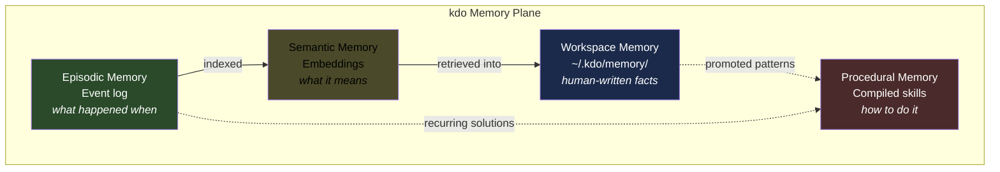
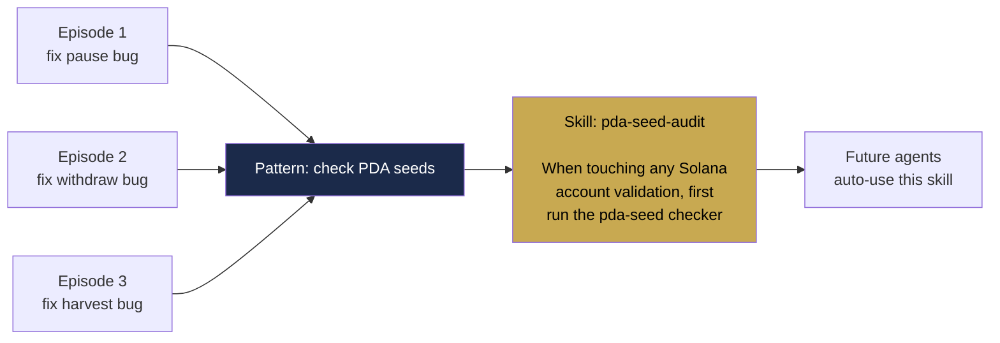

# 03 — Memory Plane

> **The differentiator.** Every orchestration framework has a control plane and
> data plane. Almost none of them treat memory as a first-class architectural
> plane. This is where kdo-factory beats LangGraph, CrewAI, AutoGen, Temporal,
> Conductor, and everyone else.

## The four memory types

Cognitive science has known this for decades. The research community only
started borrowing the vocabulary for AI agents in 2024-2025. kdo-factory
implements all four explicitly:



### Workspace Memory (declarative facts)

**Already built in v0.2.** The `.kdo/memory/` directory. Human-readable
markdown. Git-committable. Project-scoped.

Examples:
```
.kdo/memory/
  vault-program/
    decisions.md     # "we picked 3-of-5 multisig because..."
    gotchas.md       # "watch out for PDA seed encoding when..."
    conventions.md   # "all error types end in `Error` not `Err`"
  frontend/
    decisions.md
    api-shapes.md
```

**What it's good for:** slow-changing truths, architectural decisions, team
conventions, gotchas that should be known at the start of every session.

**How it's loaded:** `kdo_get_context` includes relevant memory files within
the token budget.

### Episodic Memory (event log)

**This is the Temporal-style durable execution log.** Every task execution
produces a detailed event trail:

```yaml
# .kdo/memory/episodes/2026-04-17-vault-emergency-pause/execution.yaml
episode_id: ep_01HX7K8M4N5P6Q7R8S9T0V
started_at: 2026-04-17T09:14:32Z
ended_at: 2026-04-17T10:47:18Z
specification: vault-emergency-pause
status: completed
total_tokens: 184_320
total_cost_usd: 12.47

events:
  - t: 2026-04-17T09:14:32Z
    type: PlannerStarted
    agent: planner-claude-opus-4-6
  - t: 2026-04-17T09:16:04Z
    type: PlanSubmitted
    tasks: 8
    plan_hash: sha256:...
  - t: 2026-04-17T09:16:12Z
    type: TasksCreated
    count: 8
  - t: 2026-04-17T09:16:13Z
    type: TaskAssigned
    task: add-pause-field
    agent: impl-claude-sonnet-4-6
  - t: 2026-04-17T09:18:44Z
    type: ToolCall
    tool: kdo_read_symbol
    args: { project: vault-program, symbol: VaultState }
    tokens_in: 847
    tokens_out: 312
  - t: 2026-04-17T09:19:02Z
    type: FileEdit
    path: programs/vault/src/state.rs
    diff_hash: sha256:...
  # ... hundreds more events
  - t: 2026-04-17T10:47:18Z
    type: EpisodeCompleted
    artifact: sha256:pr#4823
```

**What it's good for:**
- Durable replay (agent crashes recover from here)
- Post-mortems ("what did the agent do for 3 hours?")
- Cost attribution ("which agents cost us the most?")
- Training data for the Procedural layer

**Storage:** One YAML file per episode in `.kdo/memory/episodes/`, indexed by
date. Events also persisted as rows in the state store for fast querying.

**Retention policy:** Keep full event logs for 90 days. After that, compress
each episode into a summary (another job for the MemoryController).

### Semantic Memory (embeddings)

**Retrieval by meaning, not by keyword.** Every significant event gets
embedded and stored in a vector index. Queries return episodes relevant to
the current context.

**Vector store options** (pick based on scale):

| Scale | Store | Why |
|-------|-------|-----|
| Dev (<10K entries) | `sqlite-vec` extension | Zero-config, lives next to the SQLite state store |
| Team (<1M entries) | `qdrant` or `lancedb` | Fast, embedded, Rust-native |
| Enterprise | Pinecone / Weaviate / Turbopuffer | Managed scale |

**Embedding options:**

| Option | Cost | Privacy |
|--------|------|---------|
| Local ONNX (e.g. `all-MiniLM-L6-v2`) | Free | Fully local |
| OpenAI `text-embedding-3-small` | Cheap ($0.02 / 1M tokens) | Sends to OpenAI |
| Anthropic embeddings (when available) | TBD | Sends to Anthropic |
| Voyage AI | Cheap | Third party |

Default: local ONNX. No API calls for memory lookups. Privacy preserved.

**What gets embedded:**
- Task summaries (not full event logs — those are too noisy)
- Architectural decisions
- Bug fixes with their root cause
- Test strategies that caught real bugs
- User-added memories (`kdo memory add "..."`)

**Retrieval pattern:**

```rust
// When a new task starts, the agent gets relevant memories injected
let similar = memory.search_semantic(
    query: &task.description,
    project: &task.project,
    limit: 5,
    min_similarity: 0.75,
);

// Top-K episodes go into the initial context
for ep in similar {
    context.add_memory(ep.summary);
}
```

### Procedural Memory (compiled skills)

**The highest-leverage layer.** When the same pattern of actions succeeds
repeatedly across episodes, it gets compiled into a reusable skill. This is
where agents **learn** from experience.



**The compilation pipeline:**

1. **Pattern miner** runs weekly (MemoryController). Looks across recent
   episodes for repeated action sequences that correlate with success.
2. **Proposed skills** are surfaced to the developer as PRs against
   `.kdo/memory/skills/`. Human approval required — we don't auto-commit
   learned behavior without a review.
3. **Approved skills** become available to all future agents as
   AgentSkills-spec `SKILL.md` files. Same format that Claude Code, OpenClaw,
   and Cursor already understand.

**Example auto-generated skill:**

```markdown
---
name: pda-seed-audit
description: |
  When modifying any Solana account validation code in programs/, run the PDA
  seed auditor before writing the fix. Catches seed-encoding bugs that passed
  compile but failed at runtime in 4 recent episodes.
trigger: "file matches programs/**/*.rs AND task type = bug_fix"
compiled_from: [ep_01HX..., ep_01HY..., ep_01HZ..., ep_01J0...]
confidence: 0.87
---

# PDA Seed Audit

Before modifying account validation in any Solana program:

1. Run `kdo run audit-pda-seeds` for the affected project
2. If the audit flags any seeds, fix those first before proceeding with the
   original task
3. After your fix, re-run the audit and confirm it passes
4. Only then commit

This was learned from 4 episodes where PDA seed bugs were the root cause but
agents initially focused on symptoms.
```

**This is genuine compound leverage.** Every bug your factory solves teaches
every future agent how to avoid the class of bug that caused it.

## The memory CLI

```
kdo memory list [--project X] [--since 7d]
kdo memory show <episode_id>
kdo memory search "JWT token refresh"
kdo memory add "<fact>" [--project X] [--scope workspace|episodic]
kdo memory forget <id>
kdo memory promote <episode_id>     # request compilation into skill
kdo memory sync                     # push/pull across team via git or HTTP
```

## Multi-tenant memory and team sharing

**Single dev:** memory lives in `.kdo/memory/` in the repo. Git-committed (or
not, your choice). That's it.

**Team:** two modes:

1. **Git-native (default).** The `.kdo/memory/` directory is committed. Every
   PR that produces new memories commits them. The team gets shared memory
   through normal git operations. No server needed.
2. **Server-backed (opt-in).** For teams that don't want memories in the main
   repo, kdo supports a separate memory server (`kdo-memory-server`). Pushes
   and pulls happen via HTTP. Same markdown format, just stored off-repo.

## What kdo memory does not do

- **It doesn't replace your LLM's context window.** It supplements it.
- **It doesn't pretend to be a vector database.** For heavy semantic workloads,
  you can plug in Pinecone or Qdrant via adapter.
- **It doesn't cross repo boundaries without explicit sync.** Memory is
  project-scoped by default.
- **It doesn't auto-commit learned behavior.** Every compiled skill goes
  through human review.

## Integration with existing agents

The whole memory plane is exposed through the existing kdo MCP server:

- `kdo_memory_search(query, project?, k=5)` — semantic retrieval
- `kdo_memory_read(path)` — read a specific memory file
- `kdo_memory_add(content, scope, project?)` — write a memory
- `kdo_memory_list(project?, since?)` — enumerate recent episodes
- `kdo_skill_list(project?)` — list available compiled skills

Claude Code sees these as MCP tools. OpenClaw sees them as a skill-wrapped MCP
server. Cursor, Aider, any MCP client — all get the same memory plane.

## Continue reading

- `04-RECONCILIATION-LOOPS.md` — Memory controller specifics
- `05-SPEC-LANGUAGE.md` — How specs can require specific memory context
