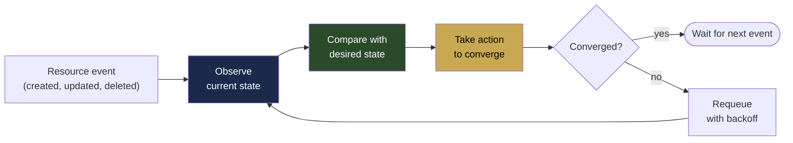
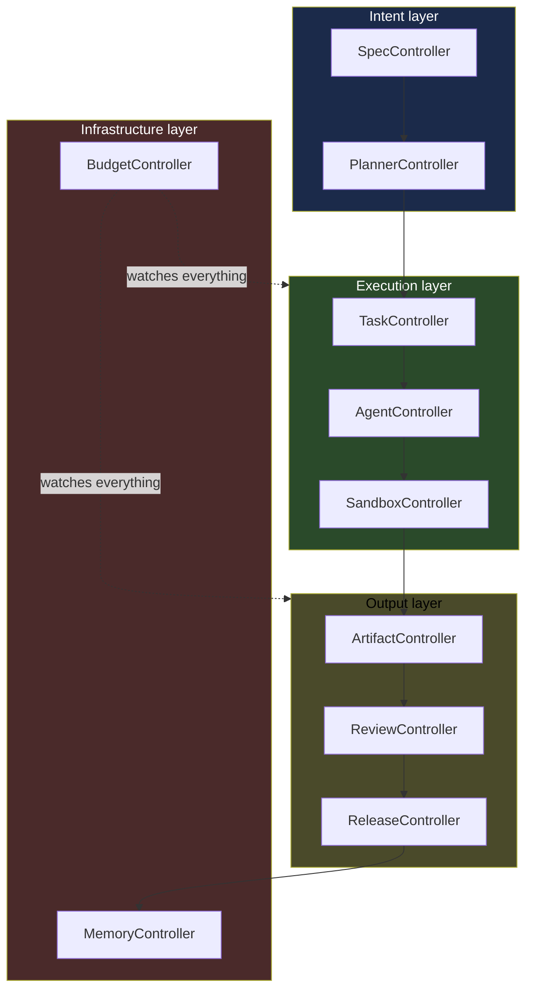
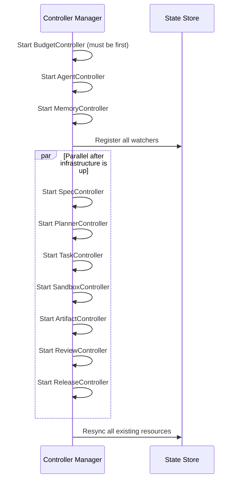

# 04 — Reconciliation Loops

> **Pattern stolen:** Kubernetes controller-manager.
> **Adapted for:** AI agent state machines.

Every resource in kdo-factory has a desired state (the `spec`) and an actual
state (the `status`). A controller is a tight little loop that watches for
drift between the two and does whatever it takes to close the gap. There are
~30 controllers in Kubernetes' controller-manager. kdo-factory starts with 10.

## The reconciliation pattern



**Three non-negotiable properties:**

1. **Idempotent.** Running the loop twice with the same input must produce the
   same result. Never "create if not exists" with a race. Always "ensure
   exists."
2. **Level-triggered, not edge-triggered.** The controller doesn't care that
   "a task was created." It cares that "this task exists and is in state X."
   If the event is lost, the next periodic resync catches the drift.
3. **Single writer per field.** Only one controller is allowed to write any
   given status field. No two controllers fighting over the same value.

## The 10 core controllers



### 1. SpecController

**Watches:** `Specification` resources.
**Reconciles:** spec → plan.

When a new spec is created:
1. Validate the spec against its JSON schema
2. Check the requested budget is within policy limits
3. Check the required agents exist and are reachable
4. Create a `Plan` resource with `status: Pending` and assign a planner agent
5. When the plan comes back, validate it fits within budget constraints
6. If approved: mark spec `status: Planning → Executing` and let
   PlannerController take over. If not: mark spec `status: Rejected` with the
   reason.

**Fields it writes:** `spec.status.phase`, `spec.status.planHash`,
`spec.status.estimatedCost`, `spec.status.rejectionReason`.

### 2. PlannerController

**Watches:** `Plan` resources.
**Reconciles:** plan → tasks.

Takes an approved plan and breaks it into concrete `Task` resources with
dependencies:

```yaml
# Input: a plan with 8 tasks and their DAG
# Output: 8 Task resources, 7 with depends_on populated
```

Writes the task DAG into the state store. TaskController takes it from here.

**Fields it writes:** `plan.status.tasksCreated`, `plan.status.dag`.

### 3. TaskController

**Watches:** `Task` resources.
**Reconciles:** task → agent assignment → completion.

The busiest controller. For each task:
1. If `status: Pending` and all `depends_on` tasks are `Completed` → mark
   `status: Schedulable`. The scheduler picks it up from there.
2. If `status: Running` and the agent's heartbeat is stale → mark
   `status: Failed` and requeue for retry (with exponential backoff).
3. If `status: Failed` and retry count < maxRetries → create a new Task with
   `retryOf: <original>` and reassign.
4. If `status: Completed` → notify dependent tasks.

**Fields it writes:** `task.status.phase`, `task.status.assignedAgent`,
`task.status.attemptCount`, `task.status.lastError`.

### 4. AgentController

**Watches:** `Agent` (node registrations) + agent heartbeats.
**Reconciles:** agent health → cluster view.

1. New agent-proxy connects → create `Agent` resource with its capabilities
2. Missed heartbeat (>30s) → mark `status: Unhealthy`
3. Agent is unhealthy → reassign its tasks to other agents
4. Agent recovers → mark `status: Healthy`, add back to the pool

**Fields it writes:** `agent.status.phase`, `agent.status.lastHeartbeat`,
`agent.status.currentTasks`.

### 5. SandboxController

**Watches:** `Sandbox` resources (git worktrees, containers, VMs).
**Reconciles:** sandbox lifecycle.

- Task goes to `Running` → create worktree/container
- Task completes → commit final state as artifact, cleanup sandbox
- Task fails → preserve sandbox for 24h for debugging, then cleanup
- Sandbox exceeds disk quota → kill the agent, mark task as failed

**Fields it writes:** `sandbox.status.path`, `sandbox.status.diskUsed`,
`sandbox.status.phase`.

### 6. ArtifactController

**Watches:** `Artifact` resources (the output of completed tasks).
**Reconciles:** artifact → reviewable PR.

When a task completes and produces an artifact (git commits in a worktree):
1. Compute the content hash of the diff
2. Deduplicate: if an identical artifact was produced in a previous episode
   for the same spec, reuse it
3. Create a draft PR on the configured git host (GitHub/Gitea/Gitlab)
4. Attach agent metadata to the PR body: spec ID, agent identity, cost, diff
   stats, event log link
5. Trigger the ReviewController

**Fields it writes:** `artifact.status.hash`, `artifact.status.prUrl`,
`artifact.status.diffStats`.

### 7. ReviewController

**Watches:** `Review` resources.
**Reconciles:** artifact → reviewed state.

For each artifact that needs review:
1. Assign a reviewer agent (from the spec, or default reviewer)
2. Send the artifact + context + original spec to the reviewer
3. Reviewer produces a verdict: `Approved`, `ChangesRequested`, `Rejected`
4. If `ChangesRequested` → create a follow-up Task for the implementer agent
5. If `Approved` → mark the artifact ready for release
6. CI results are also a form of review — the ReviewController watches CI
   webhooks and incorporates them

**Fields it writes:** `review.status.verdict`, `review.status.comments`,
`review.status.ciStatus`.

### 8. ReleaseController

**Watches:** `Release` resources.
**Reconciles:** approved artifact → shipped release.

Once an artifact is approved + CI is green + human approval obtained (for
production specs):
1. Merge the PR
2. Run release tasks declared in the spec (bump version, publish package,
   deploy to staging, run smoke tests, deploy to prod)
3. Each release step is itself a Task — same scheduling, same retries, same
   durability
4. Update the spec's `status` to `Shipped`
5. Notify the developer (Slack, email, whatever configured)

**Fields it writes:** `release.status.phase`, `release.status.version`,
`release.status.deployedTo`, `release.status.mergeCommit`.

### 9. MemoryController

**Watches:** Completed episodes + memory resources.
**Reconciles:** episode → memory plane updates.

The controller that makes the factory learn. Runs on every episode
completion and on a weekly schedule:

1. **Per-episode (on completion):**
   - Index the episode into semantic memory
   - Extract key decisions and update workspace memory drafts
   - Write the episode summary

2. **Weekly (scheduled):**
   - Mine patterns across recent episodes
   - Propose new compiled skills (PR to `.kdo/memory/skills/`)
   - Compress old episode logs (>90 days) to summaries
   - Garbage-collect embeddings for deleted memories

**Fields it writes:** `memory.status.lastIndexed`,
`memory.status.pendingSkillProposals`, `memory.status.storageBytes`.

### 10. BudgetController

**Watches:** Everything — tasks, agents, releases.
**Reconciles:** cost → budget policy.

The financial governor. Every LLM call costs money. This controller ensures
runaway agents don't drain your account:

1. Track cost per spec, per agent, per project, per day
2. When a spec approaches its budget → warn the developer
3. When a spec exceeds its budget → pause all its tasks, require human
   approval to continue
4. Enforce per-agent rate limits (to respect LLM provider rate limits)
5. Emit cost metrics to the observability stack

**Policies it enforces:**
- `maxCostPerSpec` — hard cap per spec
- `maxCostPerDay` — daily cap across all specs
- `maxCostPerAgent` — cap per agent identity
- `pauseOnBudgetWarning` — pause vs continue at warning threshold

**Fields it writes:** `spec.status.spentUsd`, `agent.status.spentUsd`,
`budget.status.currentBurnRate`.

## Controller startup order



BudgetController starts first because every other controller's decisions
depend on budget state. AgentController + MemoryController come next because
they manage infrastructure that others depend on. The rest can start in
parallel.

## Leader election (multi-replica deployments)

For single-node dev setups, one controller-manager instance runs all
controllers. For team/enterprise setups, multiple instances run with **leader
election** — only the elected leader actually reconciles. The rest sit in
hot standby.

Implementation: the standard pattern. A row in the state store
(`controller_lease`) with TTL. Instances renew; on missed renewal another
instance takes the lease. Zero coordination service needed beyond the state
store we already have.

## Observability

Every controller emits structured events on every reconciliation:

```json
{
  "controller": "TaskController",
  "resource": { "kind": "Task", "name": "impl-pause-handler" },
  "action": "Reconcile",
  "duration_ms": 12,
  "result": "RequeueAfter(30s)",
  "reason": "dependency impl-pause-field is still Running"
}
```

These flow to the event log. The dashboard reads them. The CLI exposes them:

```
kdo events --watch --controller TaskController
kdo events --watch --resource Specification/vault-emergency-pause
```

This is the single most valuable debugging feature. When the factory
misbehaves, you don't guess — you read the log of exactly what every
controller thought and did.

## Continue reading

- `05-SPEC-LANGUAGE.md` — What the developer actually writes
- `07-EXECUTION-PIPELINE.md` — End-to-end flow from spec commit to shipped release
