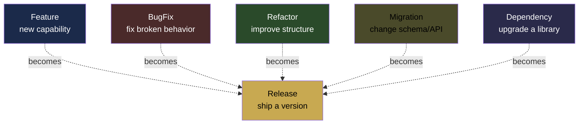

# 05 — Spec Language

> **Pattern stolen:** Kubernetes manifests.
> **Adapted for:** declaring what code should exist, not what pods should run.

The spec is the contract between the developer and the factory. The developer
declares **what** should be true about the codebase. The factory figures out
**how** to make it true. Imperative prompts go away.

## The core resource kinds



Every spec is one of these kinds. Each has its own schema. All of them produce
a Release if successful.

## Anatomy of a spec

Every spec follows this skeleton (Kubernetes-style):

```yaml
apiVersion: kdo.dev/v1
kind: <ResourceKind>
metadata:
  name: <slug>
  project: <project-name>
  labels:
    team: <team>
    priority: <low|medium|high|critical>
  annotations:
    author: <email>
    ticket: <JIRA-1234>
spec:
  # kind-specific fields
  description: <human-readable>
  acceptance:
    - <criterion 1>
    - <criterion 2>
  budget:
    max_tokens: <int>
    max_cost_usd: <float>
    max_iterations: <int>
    max_wall_clock: <duration>
  agents:
    planner: <model_or_profile>
    implementer: <model_or_profile>
    reviewer: <model_or_profile>
    tester: <model_or_profile>
  constraints:
    - <constraint 1>
    - <constraint 2>
  memory:
    load:
      - <memory_path 1>
      - <memory_path 2>
```

## Kind: Feature

Adds new capability to the codebase.

```yaml
apiVersion: kdo.dev/v1
kind: Feature
metadata:
  name: vault-emergency-pause
  project: vault-program
spec:
  description: |
    Add emergency pause capability to the vault program. Any of the three
    pause authorities can trigger pause. Unpause requires admin multisig.
  acceptance:
    - pause() instruction callable by pause_authorities
    - unpause() instruction callable only by admin
    - paused state blocks deposits, redeems, harvest
    - claim_redeem() still works when paused
    - unit tests cover all three authority paths
    - integration test covers full pause/unpause cycle
  budget:
    max_tokens: 200_000
    max_cost_usd: 15.00
    max_iterations: 8
  agents:
    planner: anthropic/claude-opus-4-6
    implementer: anthropic/claude-sonnet-4-6
    reviewer: openai/gpt-5
    tester: anthropic/claude-haiku-4-5
  constraints:
    - do not break existing deposit/redeem flows
    - preserve existing storage layout (no state migration)
    - follow existing error type convention
  memory:
    load:
      - memory://vault-program/decisions.md
      - memory://vault-program/gotchas.md
```

## Kind: BugFix

Fix a specific broken behavior. Requires a reproduction.

```yaml
apiVersion: kdo.dev/v1
kind: BugFix
metadata:
  name: fix-withdraw-precision-loss
  project: vault-program
spec:
  description: |
    Withdraw amounts > 1M tokens lose 1-2 lamports due to integer
    division ordering. Breaks whale withdrawals.
  reproduction: |
    cargo test --test integration -- --exact test_whale_withdraw
    # Observe: expected 1_000_000_000_000, actual 999_999_999_998
  expectation: |
    Withdrawal amount exactly equals requested amount, down to the
    lamport, for all amounts up to u64::MAX.
  acceptance:
    - existing test test_whale_withdraw passes
    - new test case for u64::MAX edge case passes
    - no regression in deposit/harvest math
  budget:
    max_tokens: 80_000
    max_cost_usd: 5.00
    max_iterations: 4
  agents:
    planner: anthropic/claude-sonnet-4-6
    implementer: anthropic/claude-sonnet-4-6
    reviewer: anthropic/claude-sonnet-4-6
```

## Kind: Refactor

Improve structure without changing behavior.

```yaml
apiVersion: kdo.dev/v1
kind: Refactor
metadata:
  name: extract-vault-math-crate
  project: vault-program
spec:
  description: |
    Extract all arithmetic helpers from vault-program into a separate
    vault-math crate. Makes the math auditable and reusable.
  acceptance:
    - new crate crates/vault-math exists
    - vault-program depends on vault-math
    - all existing tests pass unchanged
    - no public API changes on vault-program
    - vault-math has its own test suite covering all extracted functions
  invariants:
    - observable behavior is identical before and after (tested via snapshot tests)
    - no new dependencies added to Cargo.lock
  budget:
    max_tokens: 150_000
    max_cost_usd: 12.00
```

## Kind: Migration

Schema/API changes that require coordinated updates across multiple projects.

```yaml
apiVersion: kdo.dev/v1
kind: Migration
metadata:
  name: migrate-user-pubkey-to-i64-ids
  project: workspace
spec:
  description: |
    Replace Pubkey-based user identification with i64 user IDs across
    the frontend, API, and database.
  affected_projects:
    - frontend
    - api-server
    - db-schema
  phases:
    - name: db-schema
      description: add user_id column, backfill, add index
    - name: api-server
      description: accept either pubkey or user_id, prefer user_id
      depends_on: [db-schema]
    - name: frontend
      description: send user_id when available
      depends_on: [api-server]
    - name: api-server-cleanup
      description: drop pubkey support after 2 weeks
      depends_on: [frontend]
      schedule: 2w_after_prior_phase
  budget:
    max_tokens: 500_000
    max_cost_usd: 40.00
```

Migrations run their phases serially with real-time dependencies. A phase
scheduled `2w_after_prior_phase` gets created immediately but waits 14 days
before running (the scheduler respects the time).

## Kind: Release

Ship an approved artifact.

```yaml
apiVersion: kdo.dev/v1
kind: Release
metadata:
  name: vault-program-v0.8.0
  project: vault-program
spec:
  version: 0.8.0
  features:
    - vault-emergency-pause  # references the Feature spec
    - fix-withdraw-precision-loss
  steps:
    - name: bump-version
      command: cargo set-version 0.8.0
    - name: update-changelog
      agent: anthropic/claude-haiku-4-5
      instruction: |
        Update CHANGELOG.md with the changes in this release,
        grouped by Added/Changed/Fixed.
    - name: deploy-staging
      command: ./scripts/deploy-staging.sh
      on_success: run_smoke_tests
      on_failure: rollback
    - name: run-smoke-tests
      command: cargo test --test smoke
      depends_on: [deploy-staging]
    - name: deploy-prod
      command: ./scripts/deploy-prod.sh
      depends_on: [run-smoke-tests]
      requires_human_approval: true
```

## Kind: Dependency

Upgrade a library with test validation.

```yaml
apiVersion: kdo.dev/v1
kind: Dependency
metadata:
  name: bump-tokio-1.40
spec:
  project: "*"  # all projects in workspace
  dependency: tokio
  from: "1.38"
  to: "1.40"
  acceptance:
    - cargo update -p tokio succeeds
    - cargo build --workspace passes
    - cargo test --workspace passes
    - no new clippy warnings
    - no new RUSTSEC advisories
```

## Agent routing hints

Agents can be specified three ways:

**By model identifier:**
```yaml
agents:
  implementer: anthropic/claude-sonnet-4-6
```

**By profile (team conventions):**
```yaml
agents:
  implementer: profile://solana-implementer
  # Expands to the team's default for Solana implementation tasks
```

**By capability requirements:**
```yaml
agents:
  implementer:
    capabilities:
      - language:rust
      - framework:anchor
      - context_window: ">=200000"
    prefer:
      - cost: low
```

The scheduler resolves capability-based specifications at bind time by
matching against registered agent nodes.

## Budget tiers

Instead of hand-picking numbers, specs can declare a budget tier:

| Tier | Max tokens | Max cost | Max iterations |
|------|-----------|----------|----------------|
| `minimal` | 50K | $3 | 3 |
| `small` | 100K | $8 | 5 |
| `medium` | 250K | $20 | 8 |
| `large` | 750K | $60 | 15 |
| `epic` | 2M | $160 | 30 |

```yaml
budget: medium
```

Custom overrides still work:

```yaml
budget:
  tier: medium
  max_cost_usd: 35  # override just this field
```

## Memory injection

Specs can declare what memory should be loaded into the initial agent context:

```yaml
memory:
  load:
    - memory://vault-program/decisions.md
    - memory://common/conventions.md
  search:
    - "pda seed encoding"
    - "withdraw flow"
  exclude:
    - memory://deprecated/**
```

`load` is a direct path. `search` runs a semantic search and injects top
results. `exclude` is a pattern block. Together they give the developer
precise control over what agents "know" when they start.

## Hooks and lifecycle events

Specs can register hooks that fire at lifecycle transitions:

```yaml
hooks:
  on_plan_approved:
    - notify: slack://eng-updates
  on_task_failed:
    - retry_with_model: anthropic/claude-opus-4-6  # upgrade model on failure
    - notify: slack://oncall
  on_budget_warning:
    - notify: slack://eng-updates
    - pause_and_wait_approval: true
  on_released:
    - notify: slack://releases
    - post_to: discord://community-updates
```

## Validation

Every spec is validated at apply time:

```
kdo apply -f specs/feature-vault-pause.yaml
✓ Schema valid
✓ Project 'vault-program' exists
✓ Budget within policy (max_cost_usd=15, policy=100)
✓ Referenced memory paths exist
✓ Required agents are reachable
✓ No conflicting active specs
Spec accepted. Status: Planning
```

Invalid specs are rejected immediately with a pointer to the failing field.

## Idempotence

Applying the same spec twice does the right thing:

- If the spec is unchanged and status is terminal: no-op
- If the spec is unchanged and status is in-progress: continue
- If the spec changed: the controller diffs the change, decides if it's a
  resumable update (adjust budget, add acceptance criterion) or a reset
  (wholly different requirements)

No separate "update" command. Just re-apply.

## The CLI

```
kdo apply -f <spec.yaml>          # create or update
kdo get specifications             # list all
kdo get spec/<name>                # describe one
kdo describe spec/<name>           # full status including recent events
kdo delete spec/<name>             # cancel in-progress, mark as cancelled
kdo logs spec/<name>               # event log for this spec
kdo logs spec/<name> --follow      # stream live
kdo approve spec/<name>            # approve at a human-gate
kdo cancel spec/<name>             # stop without deleting
```

Anyone who's used `kubectl` will feel at home instantly.

## Continue reading

- `06-BRING-YOUR-OWN-LLM.md` — How agent identifiers resolve to actual providers
- `07-EXECUTION-PIPELINE.md` — What happens when a spec is applied
