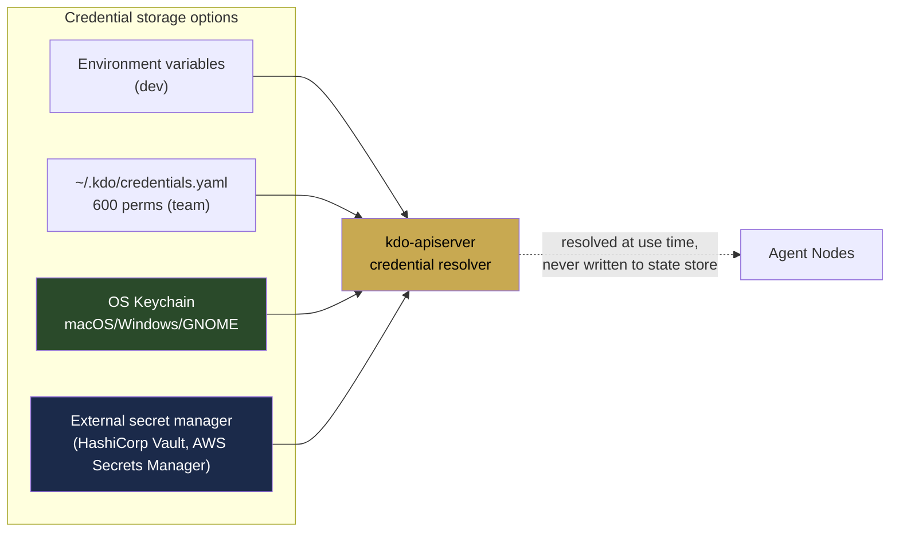
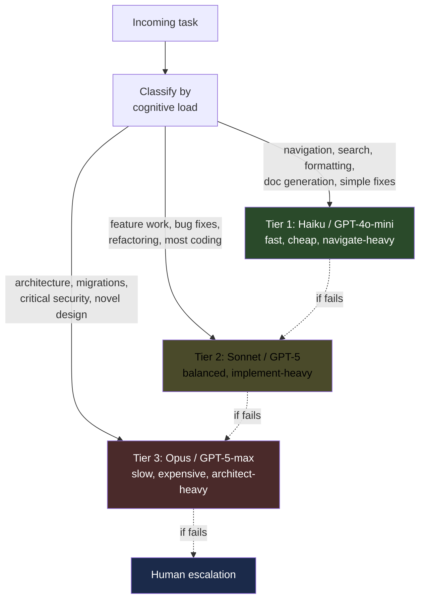

# 06 — Bring Your Own LLM

> **The core promise:** plug in your Anthropic key, your OpenAI key, your local
> Llama endpoint, your company's self-hosted model. kdo-factory doesn't care.
> It routes, retries, and bills against your keys. No middleman, no markup, no
> lock-in.

## Provider adapter interface

Every LLM provider is implemented as an adapter that satisfies one trait:

```rust
#[async_trait]
pub trait LlmProvider: Send + Sync {
    /// Provider name (e.g. "anthropic", "openai", "local-ollama")
    fn name(&self) -> &str;

    /// Which models this provider serves
    fn models(&self) -> &[ModelDescriptor];

    /// Single completion (streaming optional)
    async fn complete(
        &self,
        request: CompletionRequest,
    ) -> Result<CompletionResponse, ProviderError>;

    /// Token counting (provider-specific tokenizer)
    fn count_tokens(&self, text: &str, model: &str) -> usize;

    /// Cost estimation for planning
    fn estimate_cost(&self, request: &CompletionRequest) -> Cost;
}

pub struct ModelDescriptor {
    pub id: String,                      // "claude-sonnet-4-6"
    pub context_window: usize,           // 200_000
    pub max_output: usize,               // 8_192
    pub capabilities: ModelCapabilities, // tool_use, vision, json_mode, streaming
    pub pricing: Pricing,                // per-million input/output tokens
}
```

**Shipped adapters on day one:**

| Adapter | Provider | Notes |
|---------|----------|-------|
| `anthropic` | Anthropic API | Opus, Sonnet, Haiku |
| `openai` | OpenAI API | GPT-5, GPT-4o, o-series |
| `openai-compatible` | Any OpenAI-compatible endpoint | Together, Fireworks, Groq, DeepSeek, vLLM, LM Studio, Ollama |
| `aws-bedrock` | AWS Bedrock | Claude + Llama + Titan |
| `gcp-vertex` | Google Vertex AI | Gemini + Claude |
| `local-llama` | llama.cpp server | Direct localhost |

**Community adapters via plugin loading:**

```toml
# .kdo/factory.toml
[providers.my-internal-llm]
type = "plugin"
path = "/usr/local/lib/kdo/providers/libmy_internal_llm.so"
```

## Configuration

All keys live in one place. Three storage options depending on trust:



**Credentials never touch the state store.** They live in their source
location and are resolved just-in-time when an agent needs them. If the API
server crashes and its process memory is lost, nothing persists. This
matches how Kubernetes handles secrets in principle (even though
Kubernetes' implementation has its own flaws).

### Simple config (solo dev)

```yaml
# ~/.kdo/credentials.yaml
providers:
  anthropic:
    api_key: ${ANTHROPIC_API_KEY}      # resolved from env
  openai:
    api_key: ${OPENAI_API_KEY}
  local-ollama:
    base_url: http://localhost:11434
    # no key needed
```

### Team config

```yaml
# ~/.kdo/credentials.yaml (not committed)
providers:
  anthropic:
    api_key_ref: keychain://kdo/anthropic
  openai:
    api_key_ref: keychain://kdo/openai
  bedrock:
    access_key_ref: keychain://aws/access_key
    secret_key_ref: keychain://aws/secret_key
    region: us-west-2
```

### Enterprise config

```yaml
providers:
  anthropic:
    api_key_ref: vault://secret/data/llm/anthropic#api_key
  openai:
    api_key_ref: vault://secret/data/llm/openai#api_key
  internal-llama:
    base_url: https://llm.corp.internal
    api_key_ref: vault://secret/data/llm/internal#token
    tls:
      ca_bundle: /etc/ssl/corp-ca.pem
```

## Model routing (three-tier strategy)

Borrowing Steve Yegge's/Addy Osmani's tier model, mapped onto concrete
decisions:



Default routing rules (configurable):

```yaml
# .kdo/routing.yaml
defaults:
  planner: anthropic/claude-opus-4-6
  implementer:
    complexity:
      simple: anthropic/claude-haiku-4-5
      standard: anthropic/claude-sonnet-4-6
      complex: anthropic/claude-opus-4-6
  reviewer: openai/gpt-5
  tester: anthropic/claude-haiku-4-5
  memory_search: local-ollama/nomic-embed

fallback:
  # If primary model fails or is rate-limited
  anthropic/claude-sonnet-4-6: openai/gpt-5
  anthropic/claude-opus-4-6: openai/gpt-5
  openai/gpt-5: anthropic/claude-opus-4-6

cost_caps:
  per_task_usd: 3.00
  per_day_usd: 100.00
  alert_threshold: 0.80  # notify at 80%
```

## Multi-provider scheduling

The scheduler considers cost, latency, and capability across providers:

```rust
// Pseudocode for how the scheduler picks an agent/model combo
fn schedule_task(task: &Task, available_agents: &[Agent]) -> AgentBinding {
    let candidates = available_agents.iter()
        .filter(|a| a.matches_capabilities(&task.required_capabilities))
        .filter(|a| a.has_capacity())
        .filter(|a| task.budget.allows(a.estimated_cost(task)))
        .collect::<Vec<_>>();

    // Multi-objective scoring
    let scored = candidates.iter()
        .map(|a| {
            let s = success_rate_on_similar(a, task) * 100.0;
            let c = (1.0 - normalize(a.estimated_cost(task))) * 50.0;
            let l = (1.0 - normalize(a.latency_p95_ms)) * 20.0;
            let f = context_fit_score(a, task) * 30.0;
            let freshness = warmth_bonus(a) * 10.0;
            (a, s + c + l + f + freshness)
        })
        .max_by_key(|(_, score)| ordered_float(*score));

    AgentBinding { agent: scored.0, model: scored.0.default_model() }
}
```

## Failure handling

Every LLM call can fail in predictable ways. The agent runtime handles them
with a tiered retry strategy:

| Error | Retry? | Strategy |
|-------|--------|----------|
| `RateLimited` | Yes | Exponential backoff, honor `Retry-After` |
| `ServerError (5xx)` | Yes | Backoff, 3 attempts, then fall back to secondary provider |
| `Timeout` | Yes | Single retry with reduced context size |
| `ContextTooLarge` | No | Compress context via memory controller, retry once |
| `InvalidRequest (4xx)` | No | Report as task failure |
| `PaymentRequired` | No | Alert developer, pause all tasks on this provider |
| `Moderation / ContentPolicy` | No | Report as task failure, log for audit |

All retries are recorded in the episode log for debugging.

## Observability

Every LLM call emits:

```json
{
  "t": "2026-04-17T09:18:44Z",
  "type": "LlmCall",
  "agent_id": "agent-impl-7f3a",
  "provider": "anthropic",
  "model": "claude-sonnet-4-6",
  "tokens_in": 18_420,
  "tokens_out": 847,
  "cost_usd": 0.127,
  "latency_ms": 3_840,
  "request_hash": "sha256:...",
  "response_hash": "sha256:...",
  "tool_calls": 3
}
```

These power the cost dashboard:

```
kdo costs --today
Provider      | Model                  | Calls | Tokens       | Cost
--------------|------------------------|-------|--------------|----------
anthropic     | claude-sonnet-4-6     | 847   | 12.4M        | $37.22
anthropic     | claude-haiku-4-5      | 2,103 | 41.8M        | $10.48
openai        | gpt-5                  | 34    | 380K         | $5.84
local-ollama  | llama-3.3-70b          | 1,284 | 18.2M        | $0.00
--------------|------------------------|-------|--------------|----------
TOTAL                                  | 4,268 | 72.8M        | $53.54

Budget: $100/day (54% used)
```

## Cost predictability

Before applying a spec, the developer can see the estimated cost:

```
$ kdo apply -f specs/vault-emergency-pause.yaml --estimate
Estimated cost breakdown:
  Planning (claude-opus-4-6):        ~8K tokens, ~$0.24
  Implementation (8 tasks, sonnet):  ~120K tokens, ~$3.60
  Review (gpt-5):                    ~20K tokens, ~$0.54
  Testing (haiku):                   ~30K tokens, ~$0.09
  --------------------------------------------------
  TOTAL ESTIMATE:                    ~178K tokens, ~$4.47

Budget declared: $15.00 (3.4x buffer)
Apply? [y/N]
```

Estimates are based on historical data from similar specs (episodic memory).
Cold start estimates are conservative.

## Local-first option

Every component works with fully local models:

```yaml
# ~/.kdo/factory.toml
[providers.local]
type = "openai-compatible"
base_url = "http://localhost:11434/v1"  # Ollama
models = [
  "llama3.3:70b",
  "qwen2.5-coder:32b",
  "deepseek-coder-v3:33b"
]

[routing.defaults]
planner = "local/llama3.3:70b"
implementer = "local/qwen2.5-coder:32b"
reviewer = "local/deepseek-coder-v3:33b"
tester = "local/qwen2.5-coder:32b"
memory_search = "local/nomic-embed"
```

Zero external API calls. Air-gapped shops can run kdo-factory on their own
hardware. Cost goes from dollars per hour to electricity cost. Latency goes
up, quality goes down, but for many tasks (boilerplate, refactoring, doc
generation) it's plenty.

## No lock-in

The user's credentials belong to the user. kdo-factory:

- Never stores API keys in state
- Never routes calls through kdo-owned infrastructure
- Never adds middleware-style markup to provider costs
- Never requires a kdo cloud account for any feature
- Can be fully self-hosted on your laptop, your office server, or your VPC

This is the OSS promise. The sustainability model is sponsorship and optional
managed cloud for teams that don't want to run their own state store and
controllers — not rent-seeking on LLM calls.

## Continue reading

- `07-EXECUTION-PIPELINE.md` — How a spec becomes a shipped release
- `08-ROADMAP.md` — What ships when
