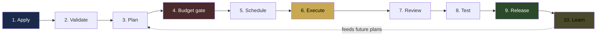
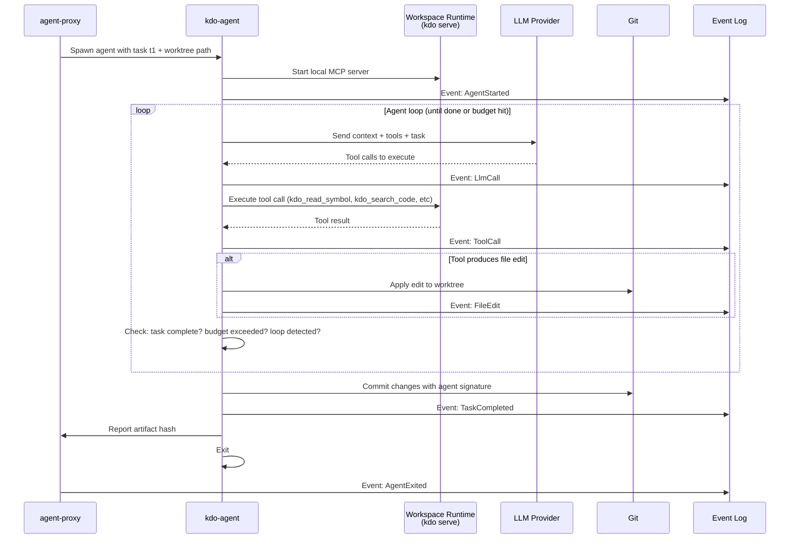
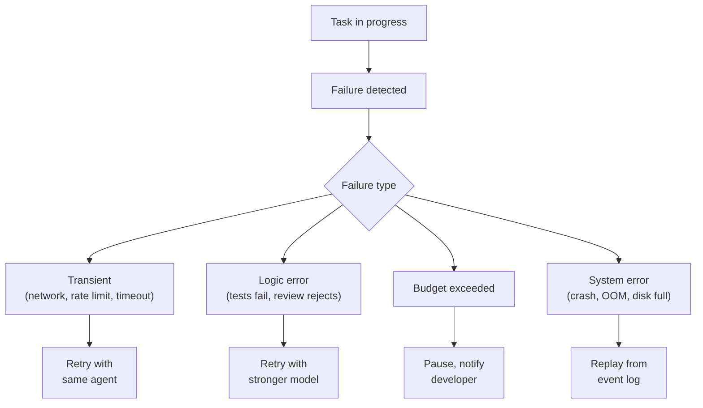

# 07 — Execution Pipeline

> **From `kdo apply` to merged PR.** This is the full journey, with every
> component on stage.

## The ten phases



## Phase 1 — Apply

```
$ kdo apply -f specs/vault-emergency-pause.yaml
```

What happens:

1. CLI reads the file, computes its hash
2. Sends `POST /api/v1/specifications` to the API server
3. API server authenticates the caller, checks RBAC
4. Validates the spec against JSON schema
5. Writes the Specification resource to the state store
6. Returns the resource UID to the CLI

**Wall clock:** <100ms. Nothing has actually started yet. The spec just
exists.

## Phase 2 — Validate

The SpecController (watching for new Specifications) picks up the event and
runs validation that schema alone can't cover:

- Does the project referenced exist? (queries workspace)
- Are the agents available? (queries agent registry)
- Is the budget within policy limits? (queries BudgetController)
- Do the memory paths referenced exist? (queries MemoryController)
- Are there any conflicting active specs on the same scope? (queries state)

If any check fails, the spec transitions to `Rejected` with the reason
recorded in `status.rejectionReason`. The developer sees it on the next
`kdo get` or via the live event stream.

**Wall clock:** 200-500ms.

## Phase 3 — Plan

If validation passed, SpecController creates a `Plan` resource and assigns
a planner agent.

```yaml
# Plan resource (auto-generated)
kind: Plan
metadata:
  name: vault-emergency-pause-plan-1
  owner: Specification/vault-emergency-pause
spec:
  planner_agent: anthropic/claude-opus-4-6
  inputs:
    - spec://vault-emergency-pause
    - memory://vault-program/decisions.md
    - memory://vault-program/gotchas.md
    - context://vault-program  # generated via kdo_get_context
status:
  phase: Pending
```

The scheduler picks this up and assigns the planner. The planner agent
receives the spec, the relevant workspace context, and the relevant memory.
It produces a structured plan:

```yaml
plan_version: 1
confidence: 0.87
estimated_cost_usd: 4.47
estimated_tokens: 178_000
tasks:
  - id: t1
    kind: code_edit
    description: Add paused bool field to VaultState struct
    agent_profile: implementer
    estimated_tokens: 8_000
    estimated_cost_usd: 0.24
    produces: [edit://programs/vault/src/state.rs]
  - id: t2
    kind: code_edit
    description: Add PauseAuthority enum and authority_for() helper
    agent_profile: implementer
    estimated_tokens: 12_000
    depends_on: [t1]
  # ... 6 more tasks
  - id: t8
    kind: integration_test
    description: Write full pause/unpause cycle test
    agent_profile: tester
    estimated_tokens: 15_000
    depends_on: [t3, t5, t7]
```

**Wall clock:** 30-120 seconds (one Opus call).

## Phase 4 — Budget gate

BudgetController evaluates the plan's cost estimate against declared budget:

| Condition | Action |
|-----------|--------|
| Estimated cost < 50% of budget | Auto-approve, proceed |
| Estimated cost 50-90% of budget | Auto-approve, warn developer |
| Estimated cost > 90% of budget | Pause, require human approval |
| Estimated cost > budget | Reject plan, ask planner to simplify |

If rejected, the spec loops back to Phase 3 with a retry counter. If the
planner can't fit after N attempts, the spec is marked `BudgetInfeasible`
and escalated to the developer.

**Wall clock:** <50ms (pure calculation).

## Phase 5 — Schedule

PlannerController creates Task resources from the approved plan. Each task
enters the pending queue.

The scheduler picks up each schedulable task (those with no unmet
dependencies) and runs the filter-score-bind pipeline (see
`01-CONTROL-PLANE.md`). Tasks get assigned to specific agent nodes.

For our example:
- `t1` (no deps) gets assigned immediately to `node-1` + sonnet
- `t2` (depends on t1) waits
- `t3` (no deps) gets assigned in parallel to `node-2` + sonnet
- `t8` (depends on multiple) waits for all deps

**Parallelism emerges naturally** from the DAG structure. Tasks with no
contention run simultaneously. The factory makes the most of available
agents without the developer orchestrating anything manually.

**Wall clock:** Continuous, event-driven. Tasks dispatch within <1 second of
becoming schedulable.

## Phase 6 — Execute

This is where agents do actual work.



Every single tool call, LLM call, file edit, and commit is recorded in the
event log. The log is the durable trail — if anything crashes, the log is
replayed to recover state.

During execution, the loop guards and budget enforcement from v0.2 are
active. An agent that loops burns its budget within the loop detection
window and gets short-circuited.

**Wall clock per task:** 30 seconds to 15 minutes typically. Simple edits
are fast; complex features take longer. Tasks have a `max_wall_clock`
timeout; if exceeded, the task is killed.

## Phase 7 — Review

After a task produces an artifact, ArtifactController creates a PR (or
updates an existing one for multi-task specs) and triggers the
ReviewController.

The reviewer agent gets:
- The original spec
- The diff produced
- The acceptance criteria
- Relevant workspace memory
- The full event log of the implementing agent (so it can see *why* the
  implementer made the decisions it made)

Reviewer produces one of:
- **Approved** — move to test phase
- **ChangesRequested** — creates follow-up Task(s) for the implementer
- **Rejected** — escalate to human; the factory can't fix this itself

**Human override:** developers can subscribe to reviews. `kdo review <spec>`
opens the PR, the diff, and reviewer comments in the browser. Approve/reject
from the PR directly; the factory respects human verdict.

**Wall clock:** 30-60 seconds per review (one call to reviewer model).

## Phase 8 — Test

Independent of the reviewer, tests run. The spec's `acceptance` criteria
translate into concrete test invocations:

```yaml
acceptance:
  - pause() instruction callable by pause_authorities
  # ↓ translates to
  - test: cargo test --test integration -- test_pause_by_authority_0 test_pause_by_authority_1 test_pause_by_authority_2
```

Tests run in the sandbox — same worktree the implementer used. The
TesterController watches the results:

- All tests pass → mark task as `Tested`, proceed to release
- Tests fail → create a follow-up Task for the implementer with the failure
  output as input
- Tests flaky → retry 3 times, alert on persistent flakiness

**CI integration:** if the project's CI already runs on the PR (GitHub
Actions etc), kdo-factory watches the webhook and incorporates those
results. No duplicate testing.

## Phase 9 — Release

ReleaseController takes over once an artifact is:
- Reviewed and approved
- Tested and passed
- (Optionally) human-approved for production specs

It runs the release pipeline declared in the spec (or a default pipeline):

```
1. Merge PR to target branch
2. Run release tasks:
   a. cargo set-version 0.8.0
   b. Update CHANGELOG.md
   c. git tag v0.8.0
   d. Push tag → triggers cargo publish via existing CI
3. Deploy:
   a. Staging deploy (automated)
   b. Smoke tests on staging
   c. Production deploy (requires human approval gate)
4. Post-release:
   a. Notify stakeholders
   b. Create follow-up monitoring alerts
```

Each step is itself a Task — same durability, same retry logic. If staging
smoke tests fail, the release halts, the developer is notified, and an
automatic rollback task fires.

**Wall clock:** Minutes to hours depending on deploy complexity. The factory
doesn't skip gates for speed.

## Phase 10 — Learn

Once the spec is shipped, MemoryController runs the learning pipeline:

1. **Episode finalization:** the full event log is compressed to an episode
   summary and indexed into semantic memory
2. **Decision extraction:** key architectural decisions from the episode are
   proposed as additions to workspace memory (via PR to the developer)
3. **Pattern mining:** the episode is compared with recent ones; if a
   repeated pattern emerges, a new compiled skill is proposed
4. **Cost attribution:** final cost accounting is recorded against the spec,
   the project, the team

The factory's output is **two things**, not one:
- The shipped release (the obvious output)
- The learned intelligence (the compounding output)

Over months of use, the factory's second output grows in value at a rate the
first output can't match. This is the core long-term moat: every shipped
spec makes the next one cheaper, faster, and more accurate.

## End-to-end example timing

For the vault-emergency-pause feature spec, realistic wall-clock timing:

| Phase | Time |
|-------|------|
| 1. Apply | <1s |
| 2. Validate | <1s |
| 3. Plan | 90s |
| 4. Budget gate | <1s |
| 5. Schedule | <1s |
| 6. Execute (8 tasks, partial parallelism) | 35 min |
| 7. Review | 2 min |
| 8. Test | 3 min |
| 9. Release (merge + deploy staging) | 8 min |
| 10. Learn | (async, doesn't block) |
| **TOTAL (developer attention)** | **~5 min** |
| **TOTAL (wall clock)** | **~50 min** |

The developer wrote a YAML file and approved a PR. Everything else ran
itself. This is the factory promise.

## Failure recovery



Every failure path is handled. Nothing silently burns budget. Nothing
silently corrupts state. The event log is the source of truth.

## Continue reading

- `08-ROADMAP.md` — What we build first, second, and last
