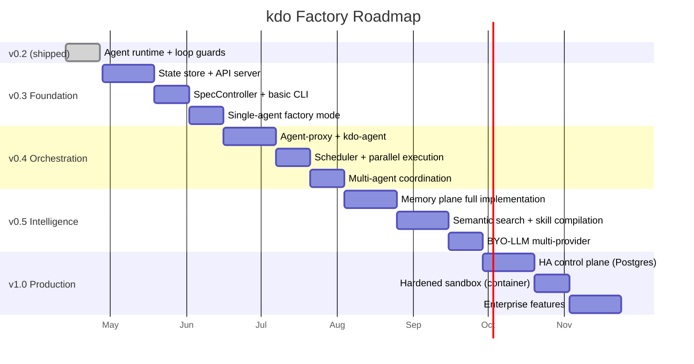

# 08 — Roadmap

> **Four releases to reach factory-grade.** Each one ships something useful
> on its own. No big-bang rewrite. The existing kdo runtime becomes one
> component of a bigger system, never replaced.

## Release overview



## v0.3 — Foundation (5 weeks)

**Theme:** Make the factory exist. No orchestration yet, just the skeleton.

### v0.3.0 ships:

- `kdo-apiserver` binary with embedded SQLite state store
- Resource CRUD: Specification, Task, Agent (single resource kinds)
- `SpecController` (the only controller in v0.3)
- `kdo apply / get / describe / delete / logs` commands
- **Single-agent factory mode:** a spec → one implementer agent → one PR
- YAML spec parser with schema validation
- Basic cost tracking (per spec, per day)
- Event stream (SSE) + `kdo events` command

### What v0.3 can do:

```bash
# Developer writes a spec
kdo apply -f specs/fix-withdraw-bug.yaml

# Factory picks it up, runs one agent (claude-sonnet-4-6)
# Agent reads workspace via existing MCP server
# Produces a PR
# Developer reviews and merges manually
```

### What v0.3 cannot do yet:

- Multi-agent orchestration (still one agent per spec)
- Planner → implementer handoff (planning is done by the implementer itself)
- Parallel task execution
- Durable replay on crash
- Memory plane (still uses v0.2's `.kdo/memory/`)

### Acceptance for v0.3:

You can write a spec, apply it, and the factory produces a PR autonomously.
The developer is only involved at spec-write time and PR-review time.
Working end-to-end beats feature-complete.

## v0.4 — Orchestration (7 weeks)

**Theme:** Make the factory work in parallel. Multi-agent coordination,
durable execution, real scheduling.

### v0.4.0 ships:

- `kdo-agent-proxy` daemon (kubelet equivalent)
- `kdo-agent` binary (per-task spawned)
- `kdo-scheduler` with filter + score + bind
- Full controller set: PlannerController, TaskController,
  AgentController, SandboxController, ArtifactController,
  ReviewController, ReleaseController, BudgetController
- Durable execution via event sourcing (Temporal-style replay)
- Git worktree sandboxing
- Multi-task specs with DAG dependencies
- Parallel task execution
- Human approval gates
- PR/review integration (GitHub first, Gitea/Gitlab follow)

### What v0.4 can do:

```bash
# Apply a multi-task feature spec
kdo apply -f specs/vault-emergency-pause.yaml

# Factory:
# 1. Planner (opus) decomposes into 8 tasks
# 2. Scheduler assigns 3 tasks to parallel agents
# 3. Tasks complete, produce artifacts
# 4. Reviewer (gpt-5) reviews
# 5. Tester (haiku) runs tests
# 6. PR created, waiting for human merge

# Developer checks in:
kdo describe spec/vault-emergency-pause
# Shows: all tasks complete, PR #4823 ready for merge
```

### What v0.4 cannot do yet:

- Semantic memory retrieval (still keyword/path-based)
- Auto-compiled skills
- Multi-provider LLM routing (still single-provider per task)
- HA / multi-instance control plane

### Acceptance for v0.4:

A feature spec with 8+ tasks runs autonomously, uses 3+ agents in parallel,
survives a simulated crash mid-execution (via replay), and produces a
mergeable PR.

## v0.5 — Intelligence (8 weeks)

**Theme:** Make the factory learn and adapt. Memory plane fully realized.
BYO-LLM with smart routing.

### v0.5.0 ships:

- Full Memory Plane: Workspace, Episodic, Semantic, Procedural
- `sqlite-vec` embedded vector store (default)
- `qdrant` adapter for team-scale memory
- Local ONNX embedding models (default, privacy-preserving)
- `kdo memory` CLI (search, add, forget, promote, sync)
- Auto-generated workspace memory from episodes
- Pattern-mined compiled skills (PR proposals)
- Multi-provider BYO-LLM: Anthropic, OpenAI, Bedrock, Vertex, OpenAI-compatible
- Smart model routing (tier 1/2/3 based on task complexity)
- Cost-aware scheduling (cheaper agents preferred for equivalent tasks)
- `kdo costs` dashboard command
- Git-native memory sync (commit `.kdo/memory/` = sync with team)

### What v0.5 can do:

```bash
# Factory now remembers
kdo apply -f specs/another-bug-fix.yaml
# Planner starts, searches semantic memory, finds 3 relevant past episodes
# Injects their decisions into context
# Implementer starts with prior knowledge, solves in half the tokens

# Factory proposes new skills
kdo memory review
# Shows: 3 proposed skills, compiled from 12 recent episodes
# Developer approves 2, rejects 1

# BYO-LLM
export ANTHROPIC_API_KEY=...
export OPENAI_API_KEY=...
# kdo automatically routes based on task complexity and cost
```

### Acceptance for v0.5:

After running 20 realistic specs, the 21st spec costs 30%+ less than the
first due to memory-augmented context. Compiled skills have been proposed.
The factory runs against local llama-3.3 for simple tasks, escalates to
Sonnet for complex ones, automatically, without developer involvement.

## v1.0 — Production (8 weeks)

**Theme:** Make the factory enterprise-credible. HA, security, compliance.

### v1.0.0 ships:

- Postgres state store backend (for team/enterprise HA)
- Multi-replica API server with load balancing
- Leader election for controllers
- Container-based sandboxing (Docker/Podman)
- RBAC with project-scoped permissions
- Audit log (every action, every decision, auditable)
- Secrets integration (Vault, AWS Secrets Manager, GCP Secret Manager)
- SAML/OIDC authentication for multi-tenant deployments
- Prometheus metrics export
- OpenTelemetry tracing end-to-end
- Web dashboard (optional, standalone binary)
- Helm chart for self-hosted deployment
- Disaster recovery: backup/restore of full state

### What v1.0 unlocks:

- Teams can run kdo-factory as a shared service
- Security teams can audit every action an agent took
- Compliance teams can prove who approved what and when
- Operators can monitor kdo-factory with their existing stack
- Organizations can self-host without worrying about HA

### What v1.0 explicitly does NOT include:

- Managed SaaS offering (separate product, post-v1.0)
- Microsoft/Google/AWS marketplace listings (post-v1.0)
- Non-git source control (SVN, Mercurial — not priority)
- Non-Rust worker implementations (Python/Go agents come later if demand)

## Post-v1.0 — Exploration

Things we'll research but not commit to:

- **Multi-cluster federation** — specs that span multiple organizations'
  factories for cross-company collaboration
- **Factory-as-a-Service** — managed kdo-factory for teams that don't want
  to self-host
- **Model fine-tuning pipeline** — take episode data, fine-tune smaller
  models that solve your team's specific patterns for 10x less money
- **Specification marketplace** — share specs across teams, like Helm charts
- **Visual spec editor** — drag-and-drop DAG builder for non-developers

## What we deliberately skip

Don't build, even if asked:

- **Proprietary agent framework.** Agents are commodity. We're infrastructure.
  LangGraph, CrewAI, AutoGen, Microsoft Agent Framework — our adapter layer
  lets all of them work with us. Being framework-agnostic is the feature.
- **Our own LLM.** Not our business. Every BYO-LLM integration is a win.
- **Closed-source core.** The control plane, runtime, and all adapters stay
  MIT. Sustainability is managed cloud (optional), sponsorships, and
  enterprise support — not rent-seeking on OSS.
- **Cross-language rewrite.** Rust only for the core components. Worker
  agents can call any language via tools, but the infrastructure is Rust.

## Version compatibility commitments

- **Specs:** `apiVersion: kdo.dev/v1` is stable from v0.5 onward. Breaking
  changes become `kdo.dev/v2` with parallel support.
- **State store schema:** Migrations are automatic on upgrade. Downgrade
  is supported one minor version back.
- **API surface:** REST endpoints follow semver. v1 endpoints stable
  forever.
- **MCP tools:** Existing v0.1-0.2 MCP tools keep working. New tools are
  additive.

## The "when will it be done" question

v1.0 target: **Q1 2027** (roughly 9 months of focused work from today's date
of 2026-04-16).

If that feels aggressive: Temporal took 5+ years to reach v1.0. Kubernetes
took 3 years from v0.1 to v1.0. kdo-factory stands on their shoulders
(durable execution + reconciliation loops are proven patterns; we're
adapting them, not inventing them). 9 months is realistic if the scope stays
disciplined.

If that feels slow: you already have v0.2 shipping today. Every minor
release ships working software that solves real problems on its own. You
don't need to wait for v1.0 to use the factory — v0.3 is useful, v0.4 is
transformative, v0.5 is compound-leverage, v1.0 is the enterprise polish.

## The one metric that matters

At v1.0, the question to answer:

> **How many developer-hours per month does kdo-factory save a real team
> of 5 engineers on a real polyglot monorepo?**

Target: 40+ hours per engineer per month. That is, 8+ hours per week per
developer of work that previously required their attention, now runs
autonomously with spec-and-review involvement only.

If we hit that number, kdo-factory is a 10x product. If we don't, we
iterate. But we measure it, with real users, on real repos, and we publish
the numbers. No marketing claims that aren't backed by a reproducible
benchmark.

## Continue reading

Go back to `00-FACTORY-VISION.md` — now that you've seen the details, the
pitch should land harder.
