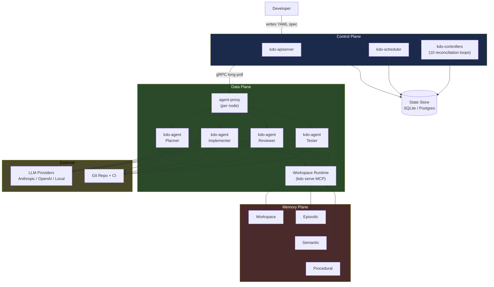

# kdo Factory — Design Documents

Ten documents. Read in order for the full picture, or jump to the one
that answers your question.

## Documents

| # | Title | What it covers |
|---|-------|----------------|
| [00](./00-FACTORY-VISION.md) | **Factory Vision** | The pitch. Three-plane model. Concrete spec-to-ship example. Why this is different from every existing tool. |
| [01](./01-CONTROL-PLANE.md) | **Control Plane** | API server, state store (SQLite/Postgres), scheduler, controller manager. How decisions get made. |
| [02](./02-DATA-PLANE.md) | **Data Plane** | Agent-proxy (kubelet), kdo-agent (pod), workspace runtime, sandbox isolation, durable execution via event sourcing. |
| [03](./03-MEMORY-PLANE.md) | **Memory Plane** | Workspace / Episodic / Semantic / Procedural memory. Auto-compiled skills from episode patterns. Team sharing via git or memory server. |
| [04](./04-RECONCILIATION-LOOPS.md) | **Reconciliation Loops** | The 10 core controllers. What each watches, what each reconciles. Observability and leader election. |
| [05](./05-SPEC-LANGUAGE.md) | **Spec Language** | The YAML contract developers write. Feature, BugFix, Refactor, Migration, Release, Dependency kinds. Budget tiers, memory injection, lifecycle hooks. |
| [06](./06-BRING-YOUR-OWN-LLM.md) | **Bring Your Own LLM** | Provider adapter interface. Anthropic, OpenAI, Bedrock, Vertex, OpenAI-compatible. Credential storage. Three-tier model routing. Local-first option. |
| [07](./07-EXECUTION-PIPELINE.md) | **Execution Pipeline** | Ten-phase journey from `kdo apply` to shipped release. Realistic wall-clock timing. Failure recovery. |
| [08](./08-ROADMAP.md) | **Roadmap** | v0.3 (foundation) → v0.4 (orchestration) → v0.5 (intelligence) → v1.0 (production). 9-month plan. |
| [09](./09-KDOW-WEB-APP.md) | **kdow Web App** | Browser-native chat surface for the agent fleet. React + Axum + MCP. Multi-agent visible UI, action approval cards, voice that controls tools, BYO-LLM. The consumer face on top of the factory. |

## The core thesis in one paragraph

Kubernetes solved container orchestration by providing a declarative control
plane, a reconciliation loop, and a cleanly separated data plane. Agent
orchestration needs exactly the same primitives, adapted for AI-specific
concerns: durable execution so multi-hour tasks survive crashes, a memory
plane so agents learn across episodes, BYO-LLM so teams keep their
credentials and costs, and an agent-agnostic runtime so any MCP-compatible
agent (Claude Code, OpenClaw, Cursor, Aider) plugs in without a bespoke
integration. kdo-factory is that infrastructure layer — not another agent
framework competing with LangGraph or CrewAI, but the infrastructure *under*
them.

## The one diagram

## What exists today (v0.2)

- `kdo` CLI with workspace compilation, polyglot manifest parsing,
  dependency graphs, token-budgeted context generation
- `kdo serve` MCP server with 7 tools
- Agent profiles for Claude Code and OpenClaw with per-profile tuning
- Loop detection + circuit breakers
- `kdo bench` reproducible token-reduction benchmark
- `kdo setup claude|openclaw` registration + config generation

**The factory adds a layer on top.** The existing MCP server becomes the
workspace runtime that every factory-managed agent uses. Claude Code users
keep using `kdo` the same way they do today. Power users upgrade to factory
mode when they want autonomous orchestration.

## What we're explicitly not building

- **Yet another agent framework** — LangGraph, CrewAI, AutoGen already exist
- **Our own LLM** — not our business, BYO-LLM is the feature
- **Closed-source core** — control plane and runtime stay MIT forever
- **SaaS-only offerings** — everything self-hostable on day one

## Next step

Paste the comprehensive Claude Code prompt (separately generated from this
design pack) that implements v0.3 — the foundation release. One working
SpecController, basic API server, embedded SQLite state store, and
single-agent factory mode end to end.

Once v0.3 ships, v0.4's orchestration layer slots on top without refactoring
the foundation. The three-plane design isolates change: each plane evolves
independently while the others stay stable.

**The factory is not a rewrite. It's an addition.**
